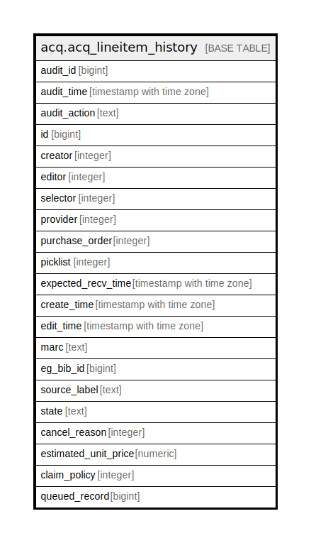

# acq.acq_lineitem_history

## Description

## Columns

| Name | Type | Default | Nullable | Children | Parents | Comment |
| ---- | ---- | ------- | -------- | -------- | ------- | ------- |
| audit_id | bigint |  | false |  |  |  |
| audit_time | timestamp with time zone |  | false |  |  |  |
| audit_action | text |  | false |  |  |  |
| id | bigint |  | false |  |  |  |
| creator | integer |  | false |  |  |  |
| editor | integer |  | false |  |  |  |
| selector | integer |  | false |  |  |  |
| provider | integer |  | true |  |  |  |
| purchase_order | integer |  | true |  |  |  |
| picklist | integer |  | true |  |  |  |
| expected_recv_time | timestamp with time zone |  | true |  |  |  |
| create_time | timestamp with time zone |  | false |  |  |  |
| edit_time | timestamp with time zone |  | false |  |  |  |
| marc | text |  | false |  |  |  |
| eg_bib_id | bigint |  | true |  |  |  |
| source_label | text |  | true |  |  |  |
| state | text |  | false |  |  |  |
| cancel_reason | integer |  | true |  |  |  |
| estimated_unit_price | numeric |  | true |  |  |  |
| claim_policy | integer |  | true |  |  |  |
| queued_record | bigint |  | true |  |  |  |

## Constraints

| Name | Type | Definition |
| ---- | ---- | ---------- |
| acq_lineitem_history_pkey | PRIMARY KEY | PRIMARY KEY (audit_id) |

## Indexes

| Name | Definition |
| ---- | ---------- |
| acq_lineitem_history_pkey | CREATE UNIQUE INDEX acq_lineitem_history_pkey ON acq.acq_lineitem_history USING btree (audit_id) |
| acq_lineitem_hist_id_idx | CREATE INDEX acq_lineitem_hist_id_idx ON acq.acq_lineitem_history USING btree (id) |
| acq_lineitem_history_queued_record_idx | CREATE INDEX acq_lineitem_history_queued_record_idx ON acq.acq_lineitem_history USING btree (queued_record) |

## Relations

---

> Generated by [tbls](https://github.com/k1LoW/tbls)
