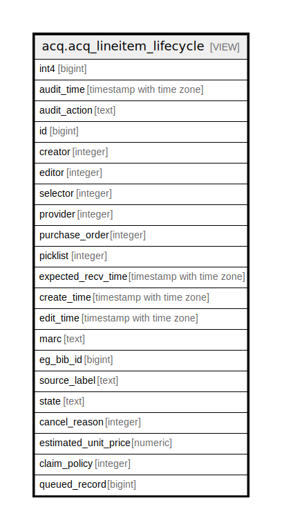

# acq.acq_lineitem_lifecycle

## Description

<details>
<summary><strong>Table Definition</strong></summary>

```sql
CREATE VIEW acq_lineitem_lifecycle AS (
 SELECT '-1'::integer AS int4,
    now() AS audit_time,
    '-'::text AS audit_action,
    lineitem.id,
    lineitem.creator,
    lineitem.editor,
    lineitem.selector,
    lineitem.provider,
    lineitem.purchase_order,
    lineitem.picklist,
    lineitem.expected_recv_time,
    lineitem.create_time,
    lineitem.edit_time,
    lineitem.marc,
    lineitem.eg_bib_id,
    lineitem.source_label,
    lineitem.state,
    lineitem.cancel_reason,
    lineitem.estimated_unit_price,
    lineitem.claim_policy,
    lineitem.queued_record
   FROM acq.lineitem
UNION ALL
 SELECT acq_lineitem_history.audit_id AS int4,
    acq_lineitem_history.audit_time,
    acq_lineitem_history.audit_action,
    acq_lineitem_history.id,
    acq_lineitem_history.creator,
    acq_lineitem_history.editor,
    acq_lineitem_history.selector,
    acq_lineitem_history.provider,
    acq_lineitem_history.purchase_order,
    acq_lineitem_history.picklist,
    acq_lineitem_history.expected_recv_time,
    acq_lineitem_history.create_time,
    acq_lineitem_history.edit_time,
    acq_lineitem_history.marc,
    acq_lineitem_history.eg_bib_id,
    acq_lineitem_history.source_label,
    acq_lineitem_history.state,
    acq_lineitem_history.cancel_reason,
    acq_lineitem_history.estimated_unit_price,
    acq_lineitem_history.claim_policy,
    acq_lineitem_history.queued_record
   FROM acq.acq_lineitem_history
)
```

</details>

## Columns

| Name | Type | Default | Nullable | Children | Parents | Comment |
| ---- | ---- | ------- | -------- | -------- | ------- | ------- |
| int4 | bigint |  | true |  |  |  |
| audit_time | timestamp with time zone |  | true |  |  |  |
| audit_action | text |  | true |  |  |  |
| id | bigint |  | true |  |  |  |
| creator | integer |  | true |  |  |  |
| editor | integer |  | true |  |  |  |
| selector | integer |  | true |  |  |  |
| provider | integer |  | true |  |  |  |
| purchase_order | integer |  | true |  |  |  |
| picklist | integer |  | true |  |  |  |
| expected_recv_time | timestamp with time zone |  | true |  |  |  |
| create_time | timestamp with time zone |  | true |  |  |  |
| edit_time | timestamp with time zone |  | true |  |  |  |
| marc | text |  | true |  |  |  |
| eg_bib_id | bigint |  | true |  |  |  |
| source_label | text |  | true |  |  |  |
| state | text |  | true |  |  |  |
| cancel_reason | integer |  | true |  |  |  |
| estimated_unit_price | numeric |  | true |  |  |  |
| claim_policy | integer |  | true |  |  |  |
| queued_record | bigint |  | true |  |  |  |

## Referenced Tables

| Name | Columns | Comment | Type |
| ---- | ------- | ------- | ---- |
| [acq.lineitem](acq.lineitem.md) | 18 |  | BASE TABLE |
| [acq.acq_lineitem_history](acq.acq_lineitem_history.md) | 21 |  | BASE TABLE |

## Relations



---

> Generated by [tbls](https://github.com/k1LoW/tbls)
