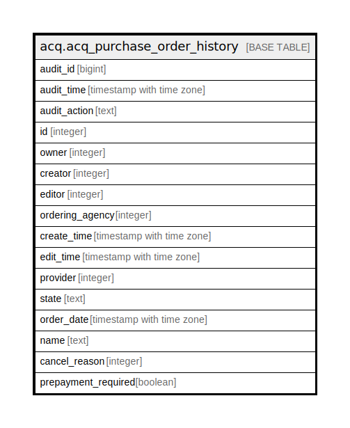

# acq.acq_purchase_order_history

## Description

## Columns

| Name | Type | Default | Nullable | Children | Parents | Comment |
| ---- | ---- | ------- | -------- | -------- | ------- | ------- |
| audit_id | bigint |  | false |  |  |  |
| audit_time | timestamp with time zone |  | false |  |  |  |
| audit_action | text |  | false |  |  |  |
| id | integer |  | false |  |  |  |
| owner | integer |  | false |  |  |  |
| creator | integer |  | false |  |  |  |
| editor | integer |  | false |  |  |  |
| ordering_agency | integer |  | false |  |  |  |
| create_time | timestamp with time zone |  | false |  |  |  |
| edit_time | timestamp with time zone |  | false |  |  |  |
| provider | integer |  | false |  |  |  |
| state | text |  | false |  |  |  |
| order_date | timestamp with time zone |  | true |  |  |  |
| name | text |  | false |  |  |  |
| cancel_reason | integer |  | true |  |  |  |
| prepayment_required | boolean |  | false |  |  |  |

## Constraints

| Name | Type | Definition |
| ---- | ---- | ---------- |
| acq_purchase_order_history_pkey | PRIMARY KEY | PRIMARY KEY (audit_id) |

## Indexes

| Name | Definition |
| ---- | ---------- |
| acq_purchase_order_history_pkey | CREATE UNIQUE INDEX acq_purchase_order_history_pkey ON acq.acq_purchase_order_history USING btree (audit_id) |
| acq_po_hist_id_idx | CREATE INDEX acq_po_hist_id_idx ON acq.acq_purchase_order_history USING btree (id) |

## Relations

---

> Generated by [tbls](https://github.com/k1LoW/tbls)
