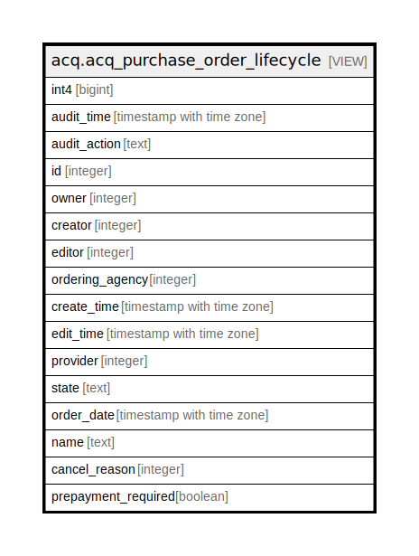

# acq.acq_purchase_order_lifecycle

## Description

<details>
<summary><strong>Table Definition</strong></summary>

```sql
CREATE VIEW acq_purchase_order_lifecycle AS (
 SELECT '-1'::integer AS int4,
    now() AS audit_time,
    '-'::text AS audit_action,
    purchase_order.id,
    purchase_order.owner,
    purchase_order.creator,
    purchase_order.editor,
    purchase_order.ordering_agency,
    purchase_order.create_time,
    purchase_order.edit_time,
    purchase_order.provider,
    purchase_order.state,
    purchase_order.order_date,
    purchase_order.name,
    purchase_order.cancel_reason,
    purchase_order.prepayment_required
   FROM acq.purchase_order
UNION ALL
 SELECT acq_purchase_order_history.audit_id AS int4,
    acq_purchase_order_history.audit_time,
    acq_purchase_order_history.audit_action,
    acq_purchase_order_history.id,
    acq_purchase_order_history.owner,
    acq_purchase_order_history.creator,
    acq_purchase_order_history.editor,
    acq_purchase_order_history.ordering_agency,
    acq_purchase_order_history.create_time,
    acq_purchase_order_history.edit_time,
    acq_purchase_order_history.provider,
    acq_purchase_order_history.state,
    acq_purchase_order_history.order_date,
    acq_purchase_order_history.name,
    acq_purchase_order_history.cancel_reason,
    acq_purchase_order_history.prepayment_required
   FROM acq.acq_purchase_order_history
)
```

</details>

## Columns

| Name | Type | Default | Nullable | Children | Parents | Comment |
| ---- | ---- | ------- | -------- | -------- | ------- | ------- |
| int4 | bigint |  | true |  |  |  |
| audit_time | timestamp with time zone |  | true |  |  |  |
| audit_action | text |  | true |  |  |  |
| id | integer |  | true |  |  |  |
| owner | integer |  | true |  |  |  |
| creator | integer |  | true |  |  |  |
| editor | integer |  | true |  |  |  |
| ordering_agency | integer |  | true |  |  |  |
| create_time | timestamp with time zone |  | true |  |  |  |
| edit_time | timestamp with time zone |  | true |  |  |  |
| provider | integer |  | true |  |  |  |
| state | text |  | true |  |  |  |
| order_date | timestamp with time zone |  | true |  |  |  |
| name | text |  | true |  |  |  |
| cancel_reason | integer |  | true |  |  |  |
| prepayment_required | boolean |  | true |  |  |  |

## Referenced Tables

| Name | Columns | Comment | Type |
| ---- | ------- | ------- | ---- |
| [acq.purchase_order](acq.purchase_order.md) | 13 |  | BASE TABLE |
| [acq.acq_purchase_order_history](acq.acq_purchase_order_history.md) | 16 |  | BASE TABLE |

## Relations



---

> Generated by [tbls](https://github.com/k1LoW/tbls)
