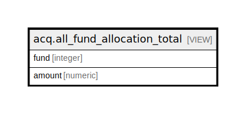

# acq.all_fund_allocation_total

## Description

<details>
<summary><strong>Table Definition</strong></summary>

```sql
CREATE VIEW all_fund_allocation_total AS (
 SELECT f.id AS fund,
    COALESCE((sum((a.amount * acq.exchange_ratio(s.currency_type, f.currency_type))))::numeric(100,2), (0)::numeric) AS amount
   FROM ((acq.fund f
     LEFT JOIN acq.fund_allocation a ON ((a.fund = f.id)))
     LEFT JOIN acq.funding_source s ON ((a.funding_source = s.id)))
  GROUP BY f.id
)
```

</details>

## Columns

| Name | Type | Default | Nullable | Children | Parents | Comment |
| ---- | ---- | ------- | -------- | -------- | ------- | ------- |
| fund | integer |  | true |  |  |  |
| amount | numeric |  | true |  |  |  |

## Referenced Tables

| Name | Columns | Comment | Type |
| ---- | ------- | ------- | ---- |
| [acq.fund](acq.fund.md) | 11 |  | BASE TABLE |
| [acq.fund_allocation](acq.fund_allocation.md) | 7 |  | BASE TABLE |
| [acq.funding_source](acq.funding_source.md) | 5 |  | BASE TABLE |

## Relations



---

> Generated by [tbls](https://github.com/k1LoW/tbls)
