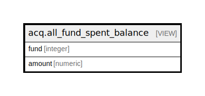

# acq.all_fund_spent_balance

## Description

<details>
<summary><strong>Table Definition</strong></summary>

```sql
CREATE VIEW all_fund_spent_balance AS (
 SELECT c.fund,
    (c.amount - d.amount) AS amount
   FROM (acq.all_fund_allocation_total c
     LEFT JOIN acq.all_fund_spent_total d USING (fund))
)
```

</details>

## Columns

| Name | Type | Default | Nullable | Children | Parents | Comment |
| ---- | ---- | ------- | -------- | -------- | ------- | ------- |
| fund | integer |  | true |  |  |  |
| amount | numeric |  | true |  |  |  |

## Referenced Tables

| Name | Columns | Comment | Type |
| ---- | ------- | ------- | ---- |
| [acq.all_fund_allocation_total](acq.all_fund_allocation_total.md) | 2 |  | VIEW |
| [acq.all_fund_spent_total](acq.all_fund_spent_total.md) | 2 |  | VIEW |

## Relations



---

> Generated by [tbls](https://github.com/k1LoW/tbls)
