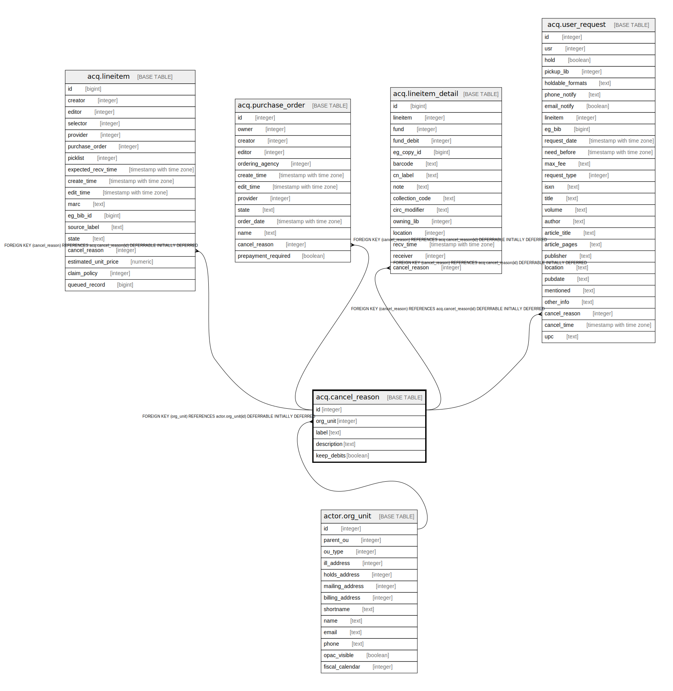

# acq.cancel_reason

## Description

## Columns

| Name | Type | Default | Nullable | Children | Parents | Comment |
| ---- | ---- | ------- | -------- | -------- | ------- | ------- |
| id | integer | nextval('acq.cancel_reason_id_seq'::regclass) | false | [acq.lineitem](acq.lineitem.md) [acq.purchase_order](acq.purchase_order.md) [acq.lineitem_detail](acq.lineitem_detail.md) [acq.user_request](acq.user_request.md) |  |  |
| org_unit | integer |  | false |  | [actor.org_unit](actor.org_unit.md) |  |
| label | text |  | false |  |  |  |
| description | text |  | false |  |  |  |
| keep_debits | boolean | false | false |  |  |  |

## Constraints

| Name | Type | Definition |
| ---- | ---- | ---------- |
| acq_cancel_reason_one_per_org_unit | UNIQUE | UNIQUE (org_unit, label) |
| cancel_reason_pkey | PRIMARY KEY | PRIMARY KEY (id) |
| cancel_reason_org_unit_fkey | FOREIGN KEY | FOREIGN KEY (org_unit) REFERENCES actor.org_unit(id) DEFERRABLE INITIALLY DEFERRED |

## Indexes

| Name | Definition |
| ---- | ---------- |
| acq_cancel_reason_one_per_org_unit | CREATE UNIQUE INDEX acq_cancel_reason_one_per_org_unit ON acq.cancel_reason USING btree (org_unit, label) |
| cancel_reason_pkey | CREATE UNIQUE INDEX cancel_reason_pkey ON acq.cancel_reason USING btree (id) |

## Triggers

| Name | Definition |
| ---- | ---------- |
| acq_no_deleted_reserved_cancel_reasons | CREATE TRIGGER acq_no_deleted_reserved_cancel_reasons BEFORE DELETE ON acq.cancel_reason FOR EACH ROW EXECUTE PROCEDURE protect_reserved_rows_from_delete('2000') |

## Relations

---

> Generated by [tbls](https://github.com/k1LoW/tbls)
