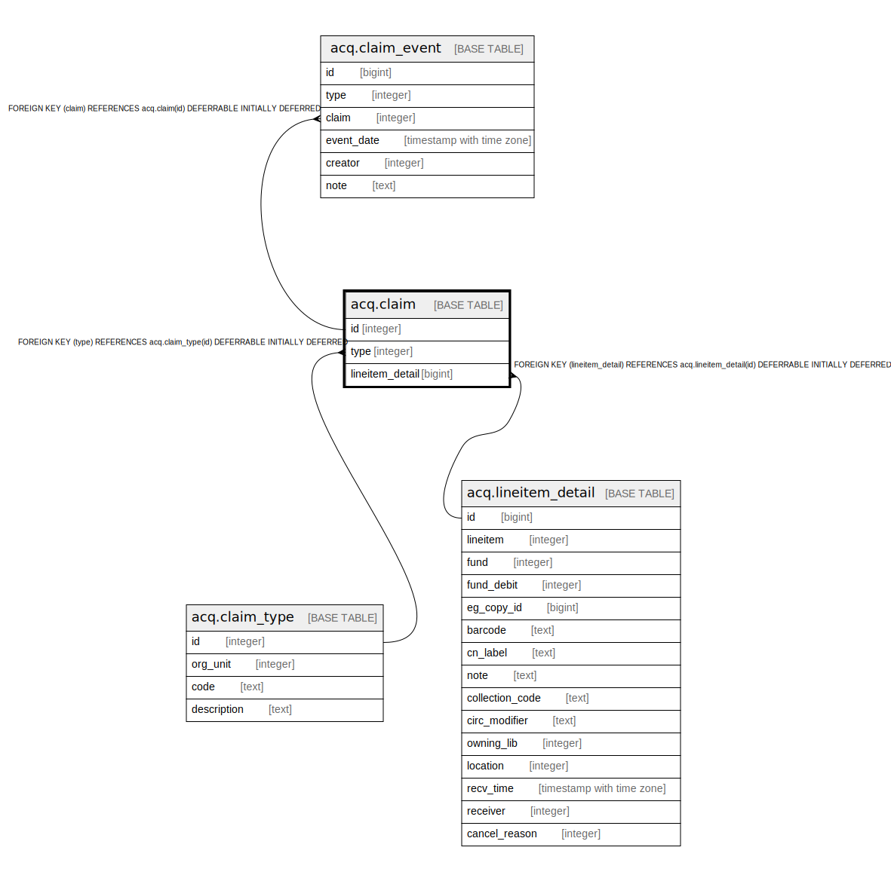

# acq.claim

## Description

## Columns

| Name | Type | Default | Nullable | Children | Parents | Comment |
| ---- | ---- | ------- | -------- | -------- | ------- | ------- |
| id | integer | nextval('acq.claim_id_seq'::regclass) | false | [acq.claim_event](acq.claim_event.md) |  |  |
| type | integer |  | false |  | [acq.claim_type](acq.claim_type.md) |  |
| lineitem_detail | bigint |  | false |  | [acq.lineitem_detail](acq.lineitem_detail.md) |  |

## Constraints

| Name | Type | Definition |
| ---- | ---- | ---------- |
| claim_pkey | PRIMARY KEY | PRIMARY KEY (id) |
| claim_type_fkey | FOREIGN KEY | FOREIGN KEY (type) REFERENCES acq.claim_type(id) DEFERRABLE INITIALLY DEFERRED |
| claim_lineitem_detail_fkey | FOREIGN KEY | FOREIGN KEY (lineitem_detail) REFERENCES acq.lineitem_detail(id) DEFERRABLE INITIALLY DEFERRED |

## Indexes

| Name | Definition |
| ---- | ---------- |
| claim_pkey | CREATE UNIQUE INDEX claim_pkey ON acq.claim USING btree (id) |
| claim_lid_idx | CREATE INDEX claim_lid_idx ON acq.claim USING btree (lineitem_detail) |

## Relations

---

> Generated by [tbls](https://github.com/k1LoW/tbls)
