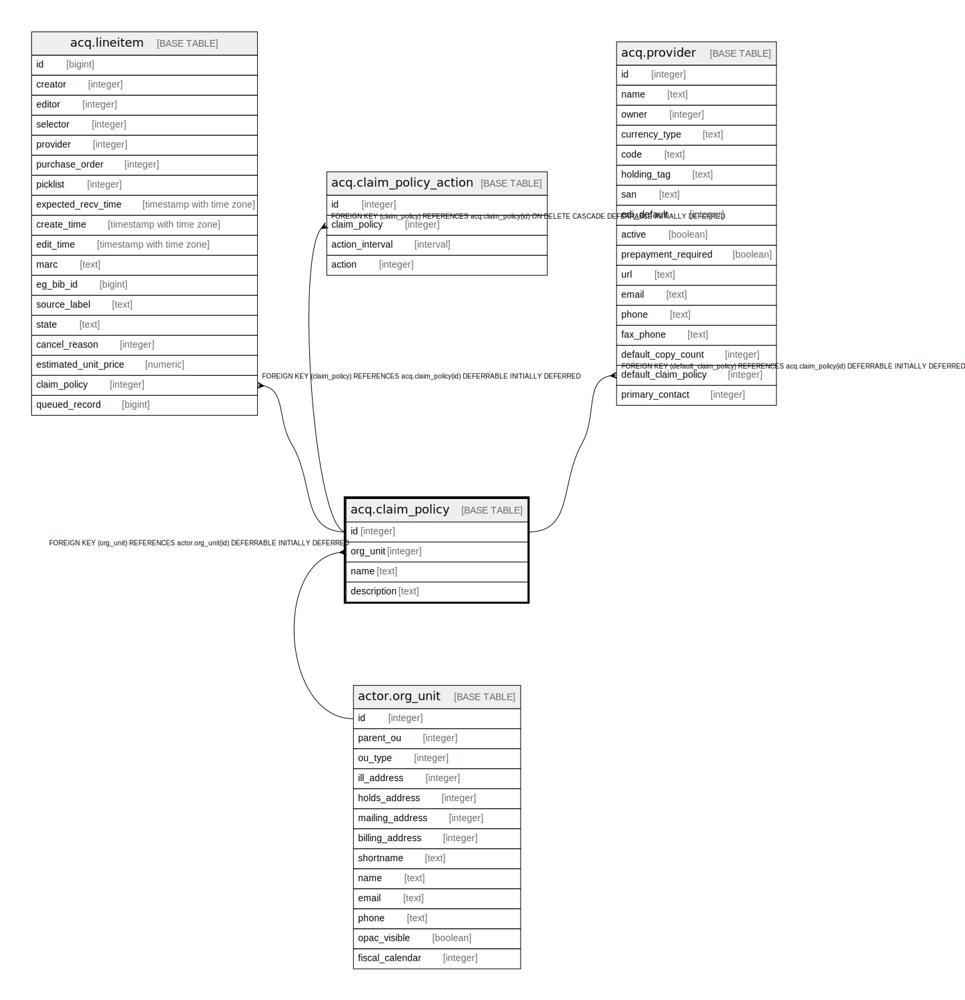

# acq.claim_policy

## Description

## Columns

| Name | Type | Default | Nullable | Children | Parents | Comment |
| ---- | ---- | ------- | -------- | -------- | ------- | ------- |
| id | integer | nextval('acq.claim_policy_id_seq'::regclass) | false | [acq.lineitem](acq.lineitem.md) [acq.claim_policy_action](acq.claim_policy_action.md) [acq.provider](acq.provider.md) |  |  |
| org_unit | integer |  | false |  | [actor.org_unit](actor.org_unit.md) |  |
| name | text |  | false |  |  |  |
| description | text |  | false |  |  |  |

## Constraints

| Name | Type | Definition |
| ---- | ---- | ---------- |
| claim_policy_pkey | PRIMARY KEY | PRIMARY KEY (id) |
| name_once_per_org | UNIQUE | UNIQUE (org_unit, name) |
| claim_policy_org_unit_fkey | FOREIGN KEY | FOREIGN KEY (org_unit) REFERENCES actor.org_unit(id) DEFERRABLE INITIALLY DEFERRED |

## Indexes

| Name | Definition |
| ---- | ---------- |
| claim_policy_pkey | CREATE UNIQUE INDEX claim_policy_pkey ON acq.claim_policy USING btree (id) |
| name_once_per_org | CREATE UNIQUE INDEX name_once_per_org ON acq.claim_policy USING btree (org_unit, name) |

## Relations

---

> Generated by [tbls](https://github.com/k1LoW/tbls)
