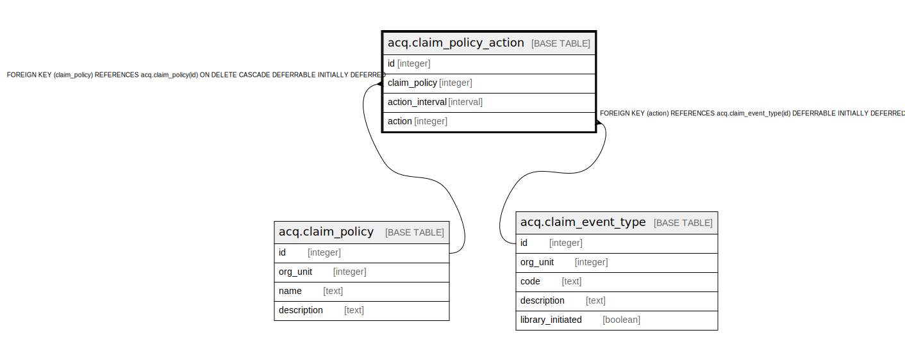

# acq.claim_policy_action

## Description

## Columns

| Name | Type | Default | Nullable | Children | Parents | Comment |
| ---- | ---- | ------- | -------- | -------- | ------- | ------- |
| id | integer | nextval('acq.claim_policy_action_id_seq'::regclass) | false |  |  |  |
| claim_policy | integer |  | false |  | [acq.claim_policy](acq.claim_policy.md) |  |
| action_interval | interval |  | false |  |  |  |
| action | integer |  | false |  | [acq.claim_event_type](acq.claim_event_type.md) |  |

## Constraints

| Name | Type | Definition |
| ---- | ---- | ---------- |
| action_sequence | UNIQUE | UNIQUE (claim_policy, action_interval) |
| claim_policy_action_action_fkey | FOREIGN KEY | FOREIGN KEY (action) REFERENCES acq.claim_event_type(id) DEFERRABLE INITIALLY DEFERRED |
| claim_policy_action_pkey | PRIMARY KEY | PRIMARY KEY (id) |
| claim_policy_action_claim_policy_fkey | FOREIGN KEY | FOREIGN KEY (claim_policy) REFERENCES acq.claim_policy(id) ON DELETE CASCADE DEFERRABLE INITIALLY DEFERRED |

## Indexes

| Name | Definition |
| ---- | ---------- |
| action_sequence | CREATE UNIQUE INDEX action_sequence ON acq.claim_policy_action USING btree (claim_policy, action_interval) |
| claim_policy_action_pkey | CREATE UNIQUE INDEX claim_policy_action_pkey ON acq.claim_policy_action USING btree (id) |

## Relations

---

> Generated by [tbls](https://github.com/k1LoW/tbls)
