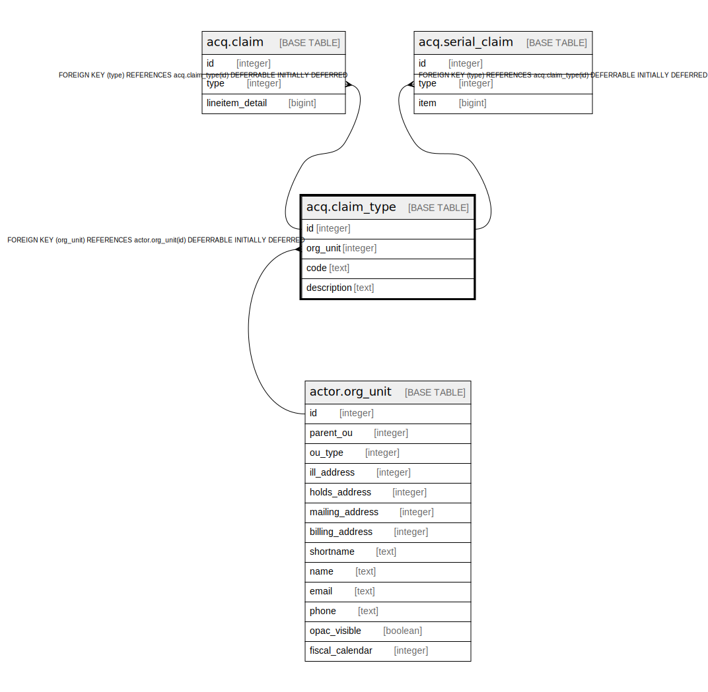

# acq.claim_type

## Description

## Columns

| Name | Type | Default | Nullable | Children | Parents | Comment |
| ---- | ---- | ------- | -------- | -------- | ------- | ------- |
| id | integer | nextval('acq.claim_type_id_seq'::regclass) | false | [acq.claim](acq.claim.md) [acq.serial_claim](acq.serial_claim.md) |  |  |
| org_unit | integer |  | false |  | [actor.org_unit](actor.org_unit.md) |  |
| code | text |  | false |  |  |  |
| description | text |  | false |  |  |  |

## Constraints

| Name | Type | Definition |
| ---- | ---- | ---------- |
| claim_type_once_per_org | UNIQUE | UNIQUE (org_unit, code) |
| claim_type_pkey | PRIMARY KEY | PRIMARY KEY (id) |
| claim_type_org_unit_fkey | FOREIGN KEY | FOREIGN KEY (org_unit) REFERENCES actor.org_unit(id) DEFERRABLE INITIALLY DEFERRED |

## Indexes

| Name | Definition |
| ---- | ---------- |
| claim_type_once_per_org | CREATE UNIQUE INDEX claim_type_once_per_org ON acq.claim_type USING btree (org_unit, code) |
| claim_type_pkey | CREATE UNIQUE INDEX claim_type_pkey ON acq.claim_type USING btree (id) |

## Relations

---

> Generated by [tbls](https://github.com/k1LoW/tbls)
