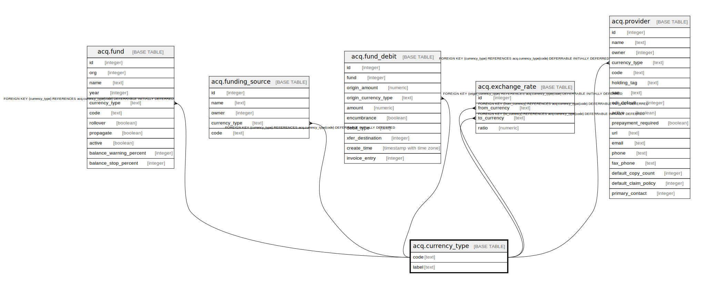

# acq.currency_type

## Description

## Columns

| Name | Type | Default | Nullable | Children | Parents | Comment |
| ---- | ---- | ------- | -------- | -------- | ------- | ------- |
| code | text |  | false | [acq.fund](acq.fund.md) [acq.funding_source](acq.funding_source.md) [acq.fund_debit](acq.fund_debit.md) [acq.exchange_rate](acq.exchange_rate.md) [acq.provider](acq.provider.md) |  |  |
| label | text |  | true |  |  |  |

## Constraints

| Name | Type | Definition |
| ---- | ---- | ---------- |
| currency_type_pkey | PRIMARY KEY | PRIMARY KEY (code) |

## Indexes

| Name | Definition |
| ---- | ---------- |
| currency_type_pkey | CREATE UNIQUE INDEX currency_type_pkey ON acq.currency_type USING btree (code) |

## Relations

---

> Generated by [tbls](https://github.com/k1LoW/tbls)
