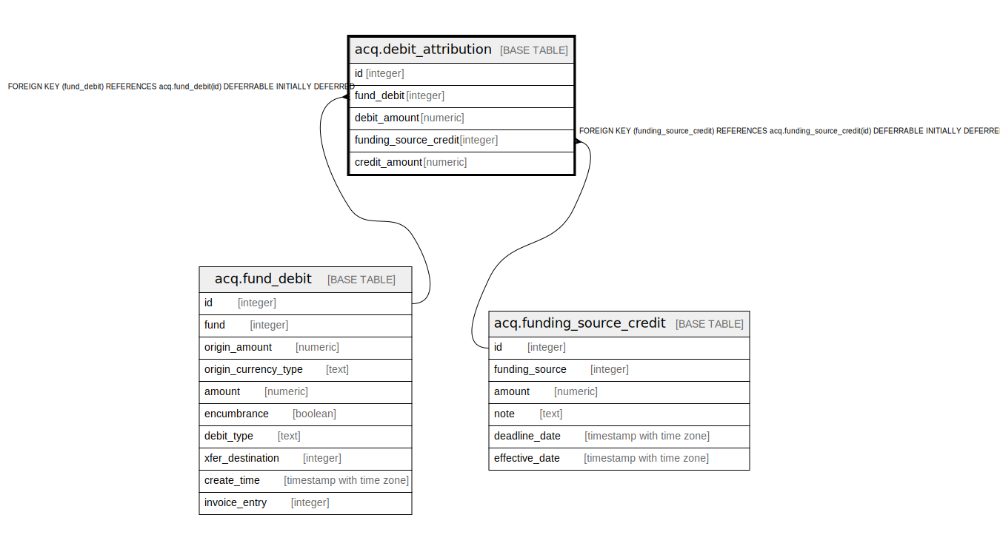

# acq.debit_attribution

## Description

## Columns

| Name | Type | Default | Nullable | Children | Parents | Comment |
| ---- | ---- | ------- | -------- | -------- | ------- | ------- |
| id | integer |  | false |  |  |  |
| fund_debit | integer |  | false |  | [acq.fund_debit](acq.fund_debit.md) |  |
| debit_amount | numeric |  | false |  |  |  |
| funding_source_credit | integer |  | true |  | [acq.funding_source_credit](acq.funding_source_credit.md) |  |
| credit_amount | numeric |  | true |  |  |  |

## Constraints

| Name | Type | Definition |
| ---- | ---- | ---------- |
| debit_attribution_pkey | PRIMARY KEY | PRIMARY KEY (id) |
| debit_attribution_fund_debit_fkey | FOREIGN KEY | FOREIGN KEY (fund_debit) REFERENCES acq.fund_debit(id) DEFERRABLE INITIALLY DEFERRED |
| debit_attribution_funding_source_credit_fkey | FOREIGN KEY | FOREIGN KEY (funding_source_credit) REFERENCES acq.funding_source_credit(id) DEFERRABLE INITIALLY DEFERRED |

## Indexes

| Name | Definition |
| ---- | ---------- |
| debit_attribution_pkey | CREATE UNIQUE INDEX debit_attribution_pkey ON acq.debit_attribution USING btree (id) |
| acq_attribution_credit_idx | CREATE INDEX acq_attribution_credit_idx ON acq.debit_attribution USING btree (funding_source_credit) |
| acq_attribution_debit_idx | CREATE INDEX acq_attribution_debit_idx ON acq.debit_attribution USING btree (fund_debit) |

## Relations

---

> Generated by [tbls](https://github.com/k1LoW/tbls)
