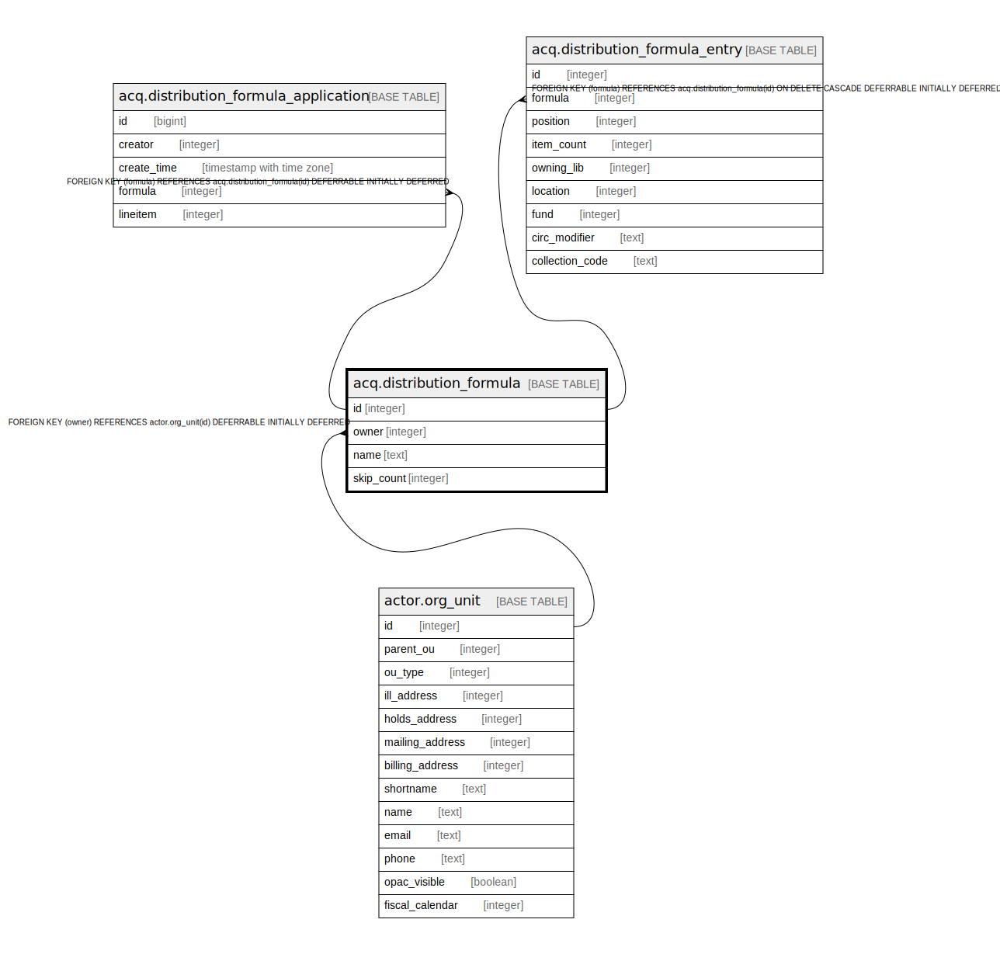

# acq.distribution_formula

## Description

## Columns

| Name | Type | Default | Nullable | Children | Parents | Comment |
| ---- | ---- | ------- | -------- | -------- | ------- | ------- |
| id | integer | nextval('acq.distribution_formula_id_seq'::regclass) | false | [acq.distribution_formula_application](acq.distribution_formula_application.md) [acq.distribution_formula_entry](acq.distribution_formula_entry.md) |  |  |
| owner | integer |  | false |  | [actor.org_unit](actor.org_unit.md) |  |
| name | text |  | false |  |  |  |
| skip_count | integer | 0 | false |  |  |  |

## Constraints

| Name | Type | Definition |
| ---- | ---- | ---------- |
| acqdf_name_once_per_owner | UNIQUE | UNIQUE (name, owner) |
| distribution_formula_pkey | PRIMARY KEY | PRIMARY KEY (id) |
| distribution_formula_owner_fkey | FOREIGN KEY | FOREIGN KEY (owner) REFERENCES actor.org_unit(id) DEFERRABLE INITIALLY DEFERRED |

## Indexes

| Name | Definition |
| ---- | ---------- |
| acqdf_name_once_per_owner | CREATE UNIQUE INDEX acqdf_name_once_per_owner ON acq.distribution_formula USING btree (name, owner) |
| distribution_formula_pkey | CREATE UNIQUE INDEX distribution_formula_pkey ON acq.distribution_formula USING btree (id) |

## Relations

---

> Generated by [tbls](https://github.com/k1LoW/tbls)
