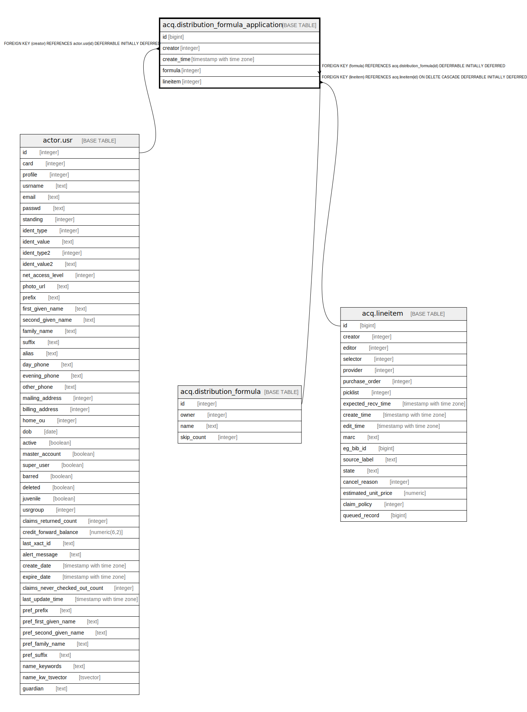

# acq.distribution_formula_application

## Description

## Columns

| Name | Type | Default | Nullable | Children | Parents | Comment |
| ---- | ---- | ------- | -------- | -------- | ------- | ------- |
| id | bigint | nextval('acq.distribution_formula_application_id_seq'::regclass) | false |  |  |  |
| creator | integer |  | false |  | [actor.usr](actor.usr.md) |  |
| create_time | timestamp with time zone | now() | false |  |  |  |
| formula | integer |  | false |  | [acq.distribution_formula](acq.distribution_formula.md) |  |
| lineitem | integer |  | false |  | [acq.lineitem](acq.lineitem.md) |  |

## Constraints

| Name | Type | Definition |
| ---- | ---- | ---------- |
| distribution_formula_application_pkey | PRIMARY KEY | PRIMARY KEY (id) |
| distribution_formula_application_formula_fkey | FOREIGN KEY | FOREIGN KEY (formula) REFERENCES acq.distribution_formula(id) DEFERRABLE INITIALLY DEFERRED |
| distribution_formula_application_lineitem_fkey | FOREIGN KEY | FOREIGN KEY (lineitem) REFERENCES acq.lineitem(id) ON DELETE CASCADE DEFERRABLE INITIALLY DEFERRED |
| distribution_formula_application_creator_fkey | FOREIGN KEY | FOREIGN KEY (creator) REFERENCES actor.usr(id) DEFERRABLE INITIALLY DEFERRED |

## Indexes

| Name | Definition |
| ---- | ---------- |
| distribution_formula_application_pkey | CREATE UNIQUE INDEX distribution_formula_application_pkey ON acq.distribution_formula_application USING btree (id) |
| acqdfa_creator_idx | CREATE INDEX acqdfa_creator_idx ON acq.distribution_formula_application USING btree (creator) |
| acqdfa_df_idx | CREATE INDEX acqdfa_df_idx ON acq.distribution_formula_application USING btree (formula) |
| acqdfa_li_idx | CREATE INDEX acqdfa_li_idx ON acq.distribution_formula_application USING btree (lineitem) |

## Relations

---

> Generated by [tbls](https://github.com/k1LoW/tbls)
