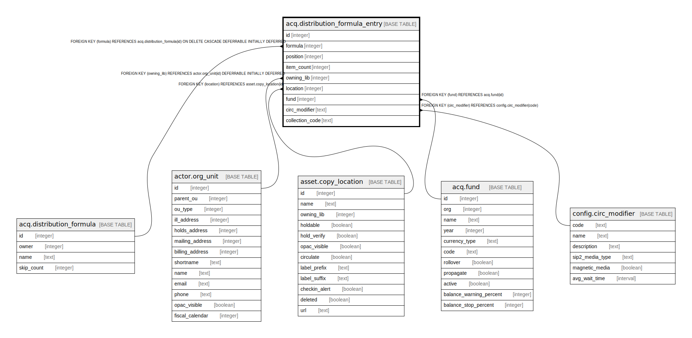

# acq.distribution_formula_entry

## Description

## Columns

| Name | Type | Default | Nullable | Children | Parents | Comment |
| ---- | ---- | ------- | -------- | -------- | ------- | ------- |
| id | integer | nextval('acq.distribution_formula_entry_id_seq'::regclass) | false |  |  |  |
| formula | integer |  | false |  | [acq.distribution_formula](acq.distribution_formula.md) |  |
| position | integer |  | false |  |  |  |
| item_count | integer |  | false |  |  |  |
| owning_lib | integer |  | true |  | [actor.org_unit](actor.org_unit.md) |  |
| location | integer |  | true |  | [asset.copy_location](asset.copy_location.md) |  |
| fund | integer |  | true |  | [acq.fund](acq.fund.md) |  |
| circ_modifier | text |  | true |  | [config.circ_modifier](config.circ_modifier.md) |  |
| collection_code | text |  | true |  |  |  |

## Constraints

| Name | Type | Definition |
| ---- | ---- | ---------- |
| acqdfe_must_be_somewhere | CHECK | CHECK (((owning_lib IS NOT NULL) OR (location IS NOT NULL))) |
| acqdfe_lib_once_per_formula | UNIQUE | UNIQUE (formula, "position") |
| distribution_formula_entry_pkey | PRIMARY KEY | PRIMARY KEY (id) |
| distribution_formula_entry_formula_fkey | FOREIGN KEY | FOREIGN KEY (formula) REFERENCES acq.distribution_formula(id) ON DELETE CASCADE DEFERRABLE INITIALLY DEFERRED |
| distribution_formula_entry_fund_fkey | FOREIGN KEY | FOREIGN KEY (fund) REFERENCES acq.fund(id) |
| distribution_formula_entry_owning_lib_fkey | FOREIGN KEY | FOREIGN KEY (owning_lib) REFERENCES actor.org_unit(id) DEFERRABLE INITIALLY DEFERRED |
| distribution_formula_entry_location_fkey | FOREIGN KEY | FOREIGN KEY (location) REFERENCES asset.copy_location(id) |
| distribution_formula_entry_circ_modifier_fkey | FOREIGN KEY | FOREIGN KEY (circ_modifier) REFERENCES config.circ_modifier(code) |

## Indexes

| Name | Definition |
| ---- | ---------- |
| acqdfe_lib_once_per_formula | CREATE UNIQUE INDEX acqdfe_lib_once_per_formula ON acq.distribution_formula_entry USING btree (formula, "position") |
| distribution_formula_entry_pkey | CREATE UNIQUE INDEX distribution_formula_entry_pkey ON acq.distribution_formula_entry USING btree (id) |

## Relations

---

> Generated by [tbls](https://github.com/k1LoW/tbls)
