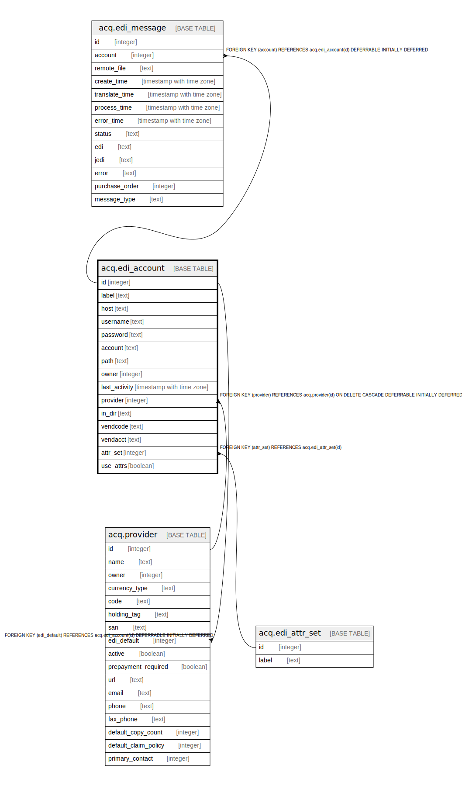

# acq.edi_account

## Description

## Columns

| Name | Type | Default | Nullable | Children | Parents | Comment |
| ---- | ---- | ------- | -------- | -------- | ------- | ------- |
| id | integer | nextval('config.remote_account_id_seq'::regclass) | false | [acq.edi_message](acq.edi_message.md) [acq.provider](acq.provider.md) |  |  |
| label | text |  | false |  |  |  |
| host | text |  | false |  |  |  |
| username | text |  | true |  |  |  |
| password | text |  | true |  |  |  |
| account | text |  | true |  |  |  |
| path | text |  | true |  |  |  |
| owner | integer |  | false |  |  |  |
| last_activity | timestamp with time zone |  | true |  |  |  |
| provider | integer |  | false |  | [acq.provider](acq.provider.md) |  |
| in_dir | text |  | true |  |  |  |
| vendcode | text |  | true |  |  |  |
| vendacct | text |  | true |  |  |  |
| attr_set | integer |  | true |  | [acq.edi_attr_set](acq.edi_attr_set.md) |  |
| use_attrs | boolean | false | false |  |  |  |

## Constraints

| Name | Type | Definition |
| ---- | ---- | ---------- |
| edi_account_pkey | PRIMARY KEY | PRIMARY KEY (id) |
| edi_account_attr_set_fkey | FOREIGN KEY | FOREIGN KEY (attr_set) REFERENCES acq.edi_attr_set(id) |
| edi_account_provider_fkey | FOREIGN KEY | FOREIGN KEY (provider) REFERENCES acq.provider(id) ON DELETE CASCADE DEFERRABLE INITIALLY DEFERRED |

## Indexes

| Name | Definition |
| ---- | ---------- |
| edi_account_pkey | CREATE UNIQUE INDEX edi_account_pkey ON acq.edi_account USING btree (id) |

## Relations

---

> Generated by [tbls](https://github.com/k1LoW/tbls)
