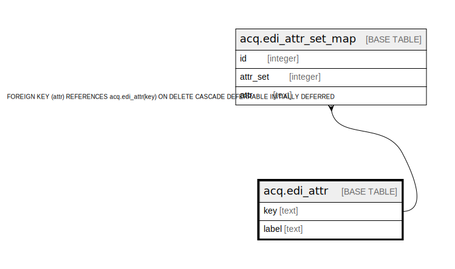

# acq.edi_attr

## Description

## Columns

| Name | Type | Default | Nullable | Children | Parents | Comment |
| ---- | ---- | ------- | -------- | -------- | ------- | ------- |
| key | text |  | false | [acq.edi_attr_set_map](acq.edi_attr_set_map.md) |  |  |
| label | text |  | false |  |  |  |

## Constraints

| Name | Type | Definition |
| ---- | ---- | ---------- |
| edi_attr_label_key | UNIQUE | UNIQUE (label) |
| edi_attr_pkey | PRIMARY KEY | PRIMARY KEY (key) |

## Indexes

| Name | Definition |
| ---- | ---------- |
| edi_attr_label_key | CREATE UNIQUE INDEX edi_attr_label_key ON acq.edi_attr USING btree (label) |
| edi_attr_pkey | CREATE UNIQUE INDEX edi_attr_pkey ON acq.edi_attr USING btree (key) |

## Relations

---

> Generated by [tbls](https://github.com/k1LoW/tbls)
