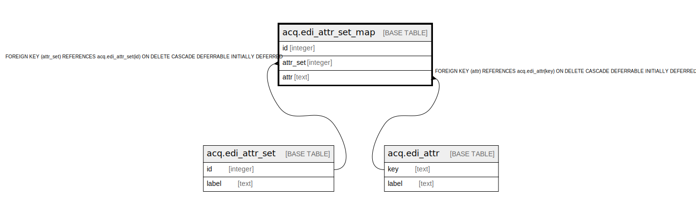

# acq.edi_attr_set_map

## Description

## Columns

| Name | Type | Default | Nullable | Children | Parents | Comment |
| ---- | ---- | ------- | -------- | -------- | ------- | ------- |
| id | integer | nextval('acq.edi_attr_set_map_id_seq'::regclass) | false |  |  |  |
| attr_set | integer |  | false |  | [acq.edi_attr_set](acq.edi_attr_set.md) |  |
| attr | text |  | false |  | [acq.edi_attr](acq.edi_attr.md) |  |

## Constraints

| Name | Type | Definition |
| ---- | ---- | ---------- |
| edi_attr_set_map_attr_fkey | FOREIGN KEY | FOREIGN KEY (attr) REFERENCES acq.edi_attr(key) ON DELETE CASCADE DEFERRABLE INITIALLY DEFERRED |
| edi_attr_set_map_attr_once | UNIQUE | UNIQUE (attr_set, attr) |
| edi_attr_set_map_pkey | PRIMARY KEY | PRIMARY KEY (id) |
| edi_attr_set_map_attr_set_fkey | FOREIGN KEY | FOREIGN KEY (attr_set) REFERENCES acq.edi_attr_set(id) ON DELETE CASCADE DEFERRABLE INITIALLY DEFERRED |

## Indexes

| Name | Definition |
| ---- | ---------- |
| edi_attr_set_map_attr_once | CREATE UNIQUE INDEX edi_attr_set_map_attr_once ON acq.edi_attr_set_map USING btree (attr_set, attr) |
| edi_attr_set_map_pkey | CREATE UNIQUE INDEX edi_attr_set_map_pkey ON acq.edi_attr_set_map USING btree (id) |

## Relations

---

> Generated by [tbls](https://github.com/k1LoW/tbls)
