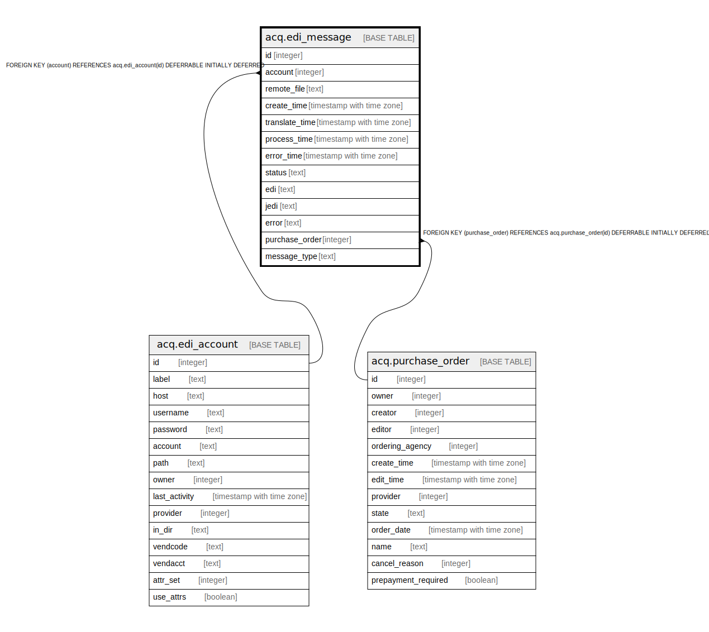

# acq.edi_message

## Description

## Columns

| Name | Type | Default | Nullable | Children | Parents | Comment |
| ---- | ---- | ------- | -------- | -------- | ------- | ------- |
| id | integer | nextval('acq.edi_message_id_seq'::regclass) | false |  |  |  |
| account | integer |  | true |  | [acq.edi_account](acq.edi_account.md) |  |
| remote_file | text |  | true |  |  |  |
| create_time | timestamp with time zone | now() | false |  |  |  |
| translate_time | timestamp with time zone |  | true |  |  |  |
| process_time | timestamp with time zone |  | true |  |  |  |
| error_time | timestamp with time zone |  | true |  |  |  |
| status | text | 'new'::text | false |  |  |  |
| edi | text |  | true |  |  |  |
| jedi | text |  | true |  |  |  |
| error | text |  | true |  |  |  |
| purchase_order | integer |  | true |  | [acq.purchase_order](acq.purchase_order.md) |  |
| message_type | text |  | false |  |  |  |

## Constraints

| Name | Type | Definition |
| ---- | ---- | ---------- |
| status_value | CHECK | CHECK ((status = ANY (ARRAY['new'::text, 'translated'::text, 'trans_error'::text, 'processed'::text, 'proc_error'::text, 'delete_error'::text, 'retry'::text, 'complete'::text]))) |
| valid_message_type | CHECK | CHECK ((message_type = ANY (ARRAY['ORDERS'::text, 'ORDRSP'::text, 'INVOIC'::text, 'OSTENQ'::text, 'OSTRPT'::text]))) |
| edi_message_account_fkey | FOREIGN KEY | FOREIGN KEY (account) REFERENCES acq.edi_account(id) DEFERRABLE INITIALLY DEFERRED |
| edi_message_pkey | PRIMARY KEY | PRIMARY KEY (id) |
| edi_message_purchase_order_fkey | FOREIGN KEY | FOREIGN KEY (purchase_order) REFERENCES acq.purchase_order(id) DEFERRABLE INITIALLY DEFERRED |

## Indexes

| Name | Definition |
| ---- | ---------- |
| edi_message_pkey | CREATE UNIQUE INDEX edi_message_pkey ON acq.edi_message USING btree (id) |
| edi_message_account_status_idx | CREATE INDEX edi_message_account_status_idx ON acq.edi_message USING btree (account, status) |
| edi_message_po_idx | CREATE INDEX edi_message_po_idx ON acq.edi_message USING btree (purchase_order) |
| edi_message_remote_file_idx | CREATE INDEX edi_message_remote_file_idx ON acq.edi_message USING btree (lowercase(remote_file)) |

## Relations

---

> Generated by [tbls](https://github.com/k1LoW/tbls)
