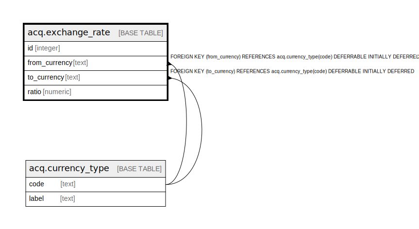

# acq.exchange_rate

## Description

## Columns

| Name | Type | Default | Nullable | Children | Parents | Comment |
| ---- | ---- | ------- | -------- | -------- | ------- | ------- |
| id | integer | nextval('acq.exchange_rate_id_seq'::regclass) | false |  |  |  |
| from_currency | text |  | false |  | [acq.currency_type](acq.currency_type.md) |  |
| to_currency | text |  | false |  | [acq.currency_type](acq.currency_type.md) |  |
| ratio | numeric |  | false |  |  |  |

## Constraints

| Name | Type | Definition |
| ---- | ---- | ---------- |
| exchange_rate_from_currency_fkey | FOREIGN KEY | FOREIGN KEY (from_currency) REFERENCES acq.currency_type(code) DEFERRABLE INITIALLY DEFERRED |
| exchange_rate_to_currency_fkey | FOREIGN KEY | FOREIGN KEY (to_currency) REFERENCES acq.currency_type(code) DEFERRABLE INITIALLY DEFERRED |
| exchange_rate_from_to_once | UNIQUE | UNIQUE (from_currency, to_currency) |
| exchange_rate_pkey | PRIMARY KEY | PRIMARY KEY (id) |

## Indexes

| Name | Definition |
| ---- | ---------- |
| exchange_rate_from_to_once | CREATE UNIQUE INDEX exchange_rate_from_to_once ON acq.exchange_rate USING btree (from_currency, to_currency) |
| exchange_rate_pkey | CREATE UNIQUE INDEX exchange_rate_pkey ON acq.exchange_rate USING btree (id) |

## Relations

---

> Generated by [tbls](https://github.com/k1LoW/tbls)
