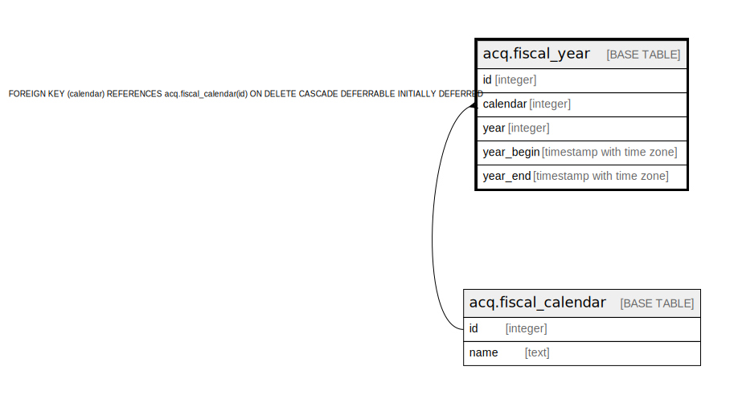

# acq.fiscal_year

## Description

## Columns

| Name | Type | Default | Nullable | Children | Parents | Comment |
| ---- | ---- | ------- | -------- | -------- | ------- | ------- |
| id | integer | nextval('acq.fiscal_year_id_seq'::regclass) | false |  |  |  |
| calendar | integer |  | false |  | [acq.fiscal_calendar](acq.fiscal_calendar.md) |  |
| year | integer |  | false |  |  |  |
| year_begin | timestamp with time zone |  | false |  |  |  |
| year_end | timestamp with time zone |  | false |  |  |  |

## Constraints

| Name | Type | Definition |
| ---- | ---- | ---------- |
| acq_fy_logical_key | UNIQUE | UNIQUE (calendar, year) |
| acq_fy_physical_key | UNIQUE | UNIQUE (calendar, year_begin) |
| fiscal_year_calendar_fkey | FOREIGN KEY | FOREIGN KEY (calendar) REFERENCES acq.fiscal_calendar(id) ON DELETE CASCADE DEFERRABLE INITIALLY DEFERRED |
| fiscal_year_pkey | PRIMARY KEY | PRIMARY KEY (id) |

## Indexes

| Name | Definition |
| ---- | ---------- |
| acq_fy_logical_key | CREATE UNIQUE INDEX acq_fy_logical_key ON acq.fiscal_year USING btree (calendar, year) |
| acq_fy_physical_key | CREATE UNIQUE INDEX acq_fy_physical_key ON acq.fiscal_year USING btree (calendar, year_begin) |
| fiscal_year_pkey | CREATE UNIQUE INDEX fiscal_year_pkey ON acq.fiscal_year USING btree (id) |

## Relations

---

> Generated by [tbls](https://github.com/k1LoW/tbls)
