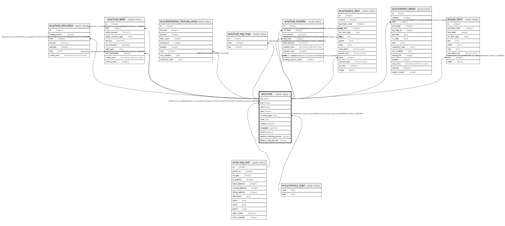

# acq.fund

## Description

## Columns

| Name | Type | Default | Nullable | Children | Parents | Comment |
| ---- | ---- | ------- | -------- | -------- | ------- | ------- |
| id | integer | nextval('acq.fund_id_seq'::regclass) | false | [acq.fund_allocation](acq.fund_allocation.md) [acq.fund_debit](acq.fund_debit.md) [acq.distribution_formula_entry](acq.distribution_formula_entry.md) [acq.fund_tag_map](acq.fund_tag_map.md) [acq.fund_transfer](acq.fund_transfer.md) [acq.invoice_item](acq.invoice_item.md) [acq.lineitem_detail](acq.lineitem_detail.md) [acq.po_item](acq.po_item.md) |  |  |
| org | integer |  | false |  | [actor.org_unit](actor.org_unit.md) |  |
| name | text |  | false |  |  |  |
| year | integer | date_part('year'::text, now()) | false |  |  |  |
| currency_type | text |  | false |  | [acq.currency_type](acq.currency_type.md) |  |
| code | text |  | true |  |  |  |
| rollover | boolean | false | false |  |  |  |
| propagate | boolean | true | false |  |  |  |
| active | boolean | true | false |  |  |  |
| balance_warning_percent | integer |  | true |  |  |  |
| balance_stop_percent | integer |  | true |  |  |  |

## Constraints

| Name | Type | Definition |
| ---- | ---- | ---------- |
| acq_fund_rollover_implies_propagate | CHECK | CHECK ((propagate OR (NOT rollover))) |
| code_once_per_org_year | UNIQUE | UNIQUE (org, code, year) |
| fund_currency_type_fkey | FOREIGN KEY | FOREIGN KEY (currency_type) REFERENCES acq.currency_type(code) DEFERRABLE INITIALLY DEFERRED |
| fund_pkey | PRIMARY KEY | PRIMARY KEY (id) |
| name_once_per_org_year | UNIQUE | UNIQUE (org, name, year) |
| fund_org_fkey | FOREIGN KEY | FOREIGN KEY (org) REFERENCES actor.org_unit(id) ON UPDATE CASCADE ON DELETE CASCADE DEFERRABLE INITIALLY DEFERRED |

## Indexes

| Name | Definition |
| ---- | ---------- |
| code_once_per_org_year | CREATE UNIQUE INDEX code_once_per_org_year ON acq.fund USING btree (org, code, year) |
| fund_pkey | CREATE UNIQUE INDEX fund_pkey ON acq.fund USING btree (id) |
| name_once_per_org_year | CREATE UNIQUE INDEX name_once_per_org_year ON acq.fund USING btree (org, name, year) |

## Relations

---

> Generated by [tbls](https://github.com/k1LoW/tbls)
