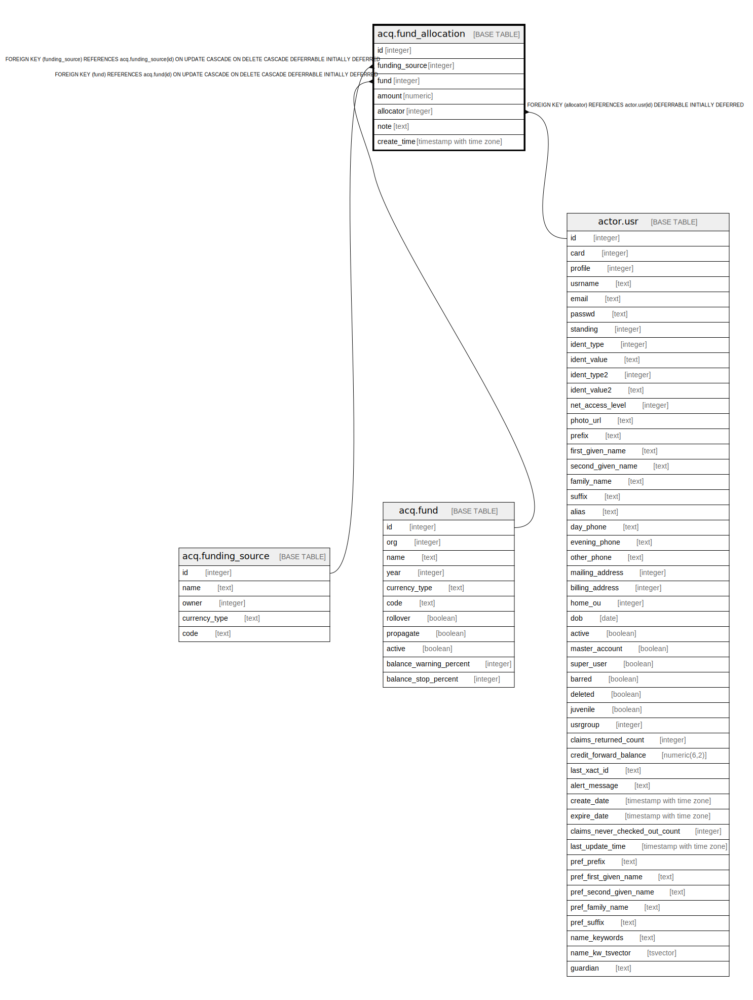

# acq.fund_allocation

## Description

## Columns

| Name | Type | Default | Nullable | Children | Parents | Comment |
| ---- | ---- | ------- | -------- | -------- | ------- | ------- |
| id | integer | nextval('acq.fund_allocation_id_seq'::regclass) | false |  |  |  |
| funding_source | integer |  | false |  | [acq.funding_source](acq.funding_source.md) |  |
| fund | integer |  | false |  | [acq.fund](acq.fund.md) |  |
| amount | numeric |  | false |  |  |  |
| allocator | integer |  | false |  | [actor.usr](actor.usr.md) |  |
| note | text |  | true |  |  |  |
| create_time | timestamp with time zone | now() | false |  |  |  |

## Constraints

| Name | Type | Definition |
| ---- | ---- | ---------- |
| fund_allocation_pkey | PRIMARY KEY | PRIMARY KEY (id) |
| fund_allocation_fund_fkey | FOREIGN KEY | FOREIGN KEY (fund) REFERENCES acq.fund(id) ON UPDATE CASCADE ON DELETE CASCADE DEFERRABLE INITIALLY DEFERRED |
| fund_allocation_funding_source_fkey | FOREIGN KEY | FOREIGN KEY (funding_source) REFERENCES acq.funding_source(id) ON UPDATE CASCADE ON DELETE CASCADE DEFERRABLE INITIALLY DEFERRED |
| fund_allocation_allocator_fkey | FOREIGN KEY | FOREIGN KEY (allocator) REFERENCES actor.usr(id) DEFERRABLE INITIALLY DEFERRED |

## Indexes

| Name | Definition |
| ---- | ---------- |
| fund_allocation_pkey | CREATE UNIQUE INDEX fund_allocation_pkey ON acq.fund_allocation USING btree (id) |
| fund_alloc_allocator_idx | CREATE INDEX fund_alloc_allocator_idx ON acq.fund_allocation USING btree (allocator) |

## Relations

---

> Generated by [tbls](https://github.com/k1LoW/tbls)
