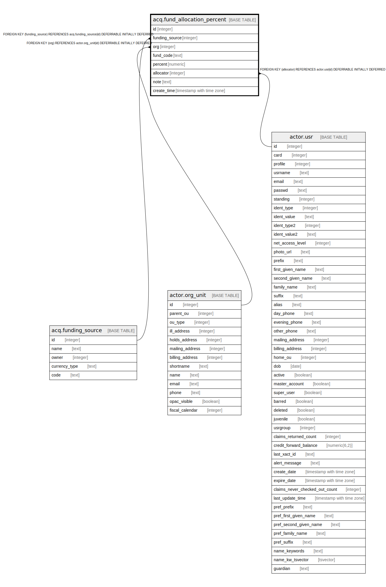

# acq.fund_allocation_percent

## Description

## Columns

| Name | Type | Default | Nullable | Children | Parents | Comment |
| ---- | ---- | ------- | -------- | -------- | ------- | ------- |
| id | integer | nextval('acq.fund_allocation_percent_id_seq'::regclass) | false |  |  |  |
| funding_source | integer |  | false |  | [acq.funding_source](acq.funding_source.md) |  |
| org | integer |  | false |  | [actor.org_unit](actor.org_unit.md) |  |
| fund_code | text |  | true |  |  |  |
| percent | numeric |  | false |  |  |  |
| allocator | integer |  | false |  | [actor.usr](actor.usr.md) |  |
| note | text |  | true |  |  |  |
| create_time | timestamp with time zone | now() | false |  |  |  |

## Constraints

| Name | Type | Definition |
| ---- | ---- | ---------- |
| percentage_range | CHECK | CHECK (((percent >= (0)::numeric) AND (percent <= (100)::numeric))) |
| fund_allocation_percent_pkey | PRIMARY KEY | PRIMARY KEY (id) |
| fund_allocation_percent_funding_source_fkey | FOREIGN KEY | FOREIGN KEY (funding_source) REFERENCES acq.funding_source(id) DEFERRABLE INITIALLY DEFERRED |
| logical_key | UNIQUE | UNIQUE (funding_source, org, fund_code) |
| fund_allocation_percent_org_fkey | FOREIGN KEY | FOREIGN KEY (org) REFERENCES actor.org_unit(id) DEFERRABLE INITIALLY DEFERRED |
| fund_allocation_percent_allocator_fkey | FOREIGN KEY | FOREIGN KEY (allocator) REFERENCES actor.usr(id) DEFERRABLE INITIALLY DEFERRED |

## Indexes

| Name | Definition |
| ---- | ---------- |
| fund_allocation_percent_pkey | CREATE UNIQUE INDEX fund_allocation_percent_pkey ON acq.fund_allocation_percent USING btree (id) |
| logical_key | CREATE UNIQUE INDEX logical_key ON acq.fund_allocation_percent USING btree (funding_source, org, fund_code) |

## Triggers

| Name | Definition |
| ---- | ---------- |
| acq_fund_alloc_percent_val_trig | CREATE TRIGGER acq_fund_alloc_percent_val_trig BEFORE INSERT OR UPDATE ON acq.fund_allocation_percent FOR EACH ROW EXECUTE PROCEDURE acq.fund_alloc_percent_val() |
| acqfap_limit_100_trig | CREATE TRIGGER acqfap_limit_100_trig AFTER INSERT OR UPDATE ON acq.fund_allocation_percent FOR EACH ROW EXECUTE PROCEDURE acq.fap_limit_100() |

## Relations

---

> Generated by [tbls](https://github.com/k1LoW/tbls)
