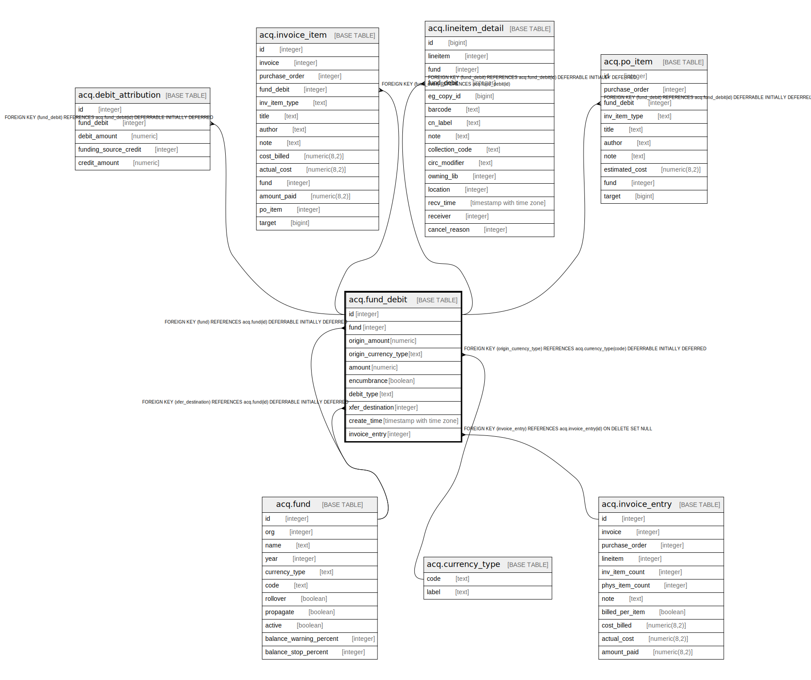

# acq.fund_debit

## Description

## Columns

| Name | Type | Default | Nullable | Children | Parents | Comment |
| ---- | ---- | ------- | -------- | -------- | ------- | ------- |
| id | integer | nextval('acq.fund_debit_id_seq'::regclass) | false | [acq.debit_attribution](acq.debit_attribution.md) [acq.invoice_item](acq.invoice_item.md) [acq.lineitem_detail](acq.lineitem_detail.md) [acq.po_item](acq.po_item.md) |  |  |
| fund | integer |  | false |  | [acq.fund](acq.fund.md) |  |
| origin_amount | numeric |  | false |  |  |  |
| origin_currency_type | text |  | false |  | [acq.currency_type](acq.currency_type.md) |  |
| amount | numeric |  | false |  |  |  |
| encumbrance | boolean | true | false |  |  |  |
| debit_type | text |  | false |  |  |  |
| xfer_destination | integer |  | true |  | [acq.fund](acq.fund.md) |  |
| create_time | timestamp with time zone | now() | false |  |  |  |
| invoice_entry | integer |  | true |  | [acq.invoice_entry](acq.invoice_entry.md) |  |

## Constraints

| Name | Type | Definition |
| ---- | ---- | ---------- |
| fund_debit_origin_currency_type_fkey | FOREIGN KEY | FOREIGN KEY (origin_currency_type) REFERENCES acq.currency_type(code) DEFERRABLE INITIALLY DEFERRED |
| fund_debit_pkey | PRIMARY KEY | PRIMARY KEY (id) |
| fund_debit_fund_fkey | FOREIGN KEY | FOREIGN KEY (fund) REFERENCES acq.fund(id) DEFERRABLE INITIALLY DEFERRED |
| fund_debit_xfer_destination_fkey | FOREIGN KEY | FOREIGN KEY (xfer_destination) REFERENCES acq.fund(id) DEFERRABLE INITIALLY DEFERRED |
| fund_debit_invoice_entry_fkey | FOREIGN KEY | FOREIGN KEY (invoice_entry) REFERENCES acq.invoice_entry(id) ON DELETE SET NULL |

## Indexes

| Name | Definition |
| ---- | ---------- |
| fund_debit_pkey | CREATE UNIQUE INDEX fund_debit_pkey ON acq.fund_debit USING btree (id) |
| fund_debit_invoice_entry_idx | CREATE INDEX fund_debit_invoice_entry_idx ON acq.fund_debit USING btree (invoice_entry) |

## Relations

---

> Generated by [tbls](https://github.com/k1LoW/tbls)
