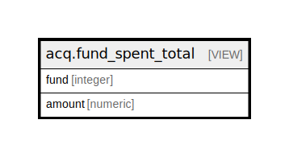

# acq.fund_spent_total

## Description

<details>
<summary><strong>Table Definition</strong></summary>

```sql
CREATE VIEW fund_spent_total AS (
 SELECT fund.id AS fund,
    sum(COALESCE(fund_debit.amount, (0)::numeric)) AS amount
   FROM (acq.fund fund
     LEFT JOIN acq.fund_debit fund_debit ON ((fund.id = fund_debit.fund)))
  WHERE (NOT fund_debit.encumbrance)
  GROUP BY fund.id
)
```

</details>

## Columns

| Name | Type | Default | Nullable | Children | Parents | Comment |
| ---- | ---- | ------- | -------- | -------- | ------- | ------- |
| fund | integer |  | true |  |  |  |
| amount | numeric |  | true |  |  |  |

## Referenced Tables

| Name | Columns | Comment | Type |
| ---- | ------- | ------- | ---- |
| [acq.fund](acq.fund.md) | 11 |  | BASE TABLE |
| [acq.fund_debit](acq.fund_debit.md) | 10 |  | BASE TABLE |

## Relations



---

> Generated by [tbls](https://github.com/k1LoW/tbls)
