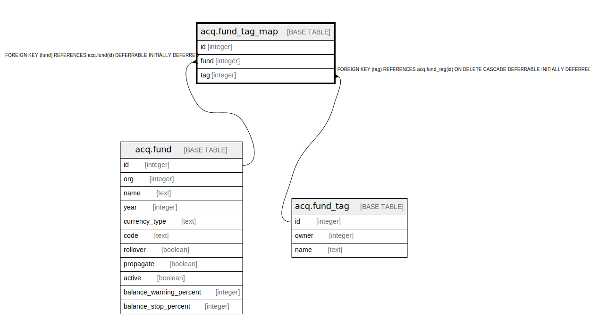

# acq.fund_tag_map

## Description

## Columns

| Name | Type | Default | Nullable | Children | Parents | Comment |
| ---- | ---- | ------- | -------- | -------- | ------- | ------- |
| id | integer | nextval('acq.fund_tag_map_id_seq'::regclass) | false |  |  |  |
| fund | integer |  | false |  | [acq.fund](acq.fund.md) |  |
| tag | integer |  | true |  | [acq.fund_tag](acq.fund_tag.md) |  |

## Constraints

| Name | Type | Definition |
| ---- | ---- | ---------- |
| acqftm_fund_once_per_tag | UNIQUE | UNIQUE (fund, tag) |
| fund_tag_map_fund_fkey | FOREIGN KEY | FOREIGN KEY (fund) REFERENCES acq.fund(id) DEFERRABLE INITIALLY DEFERRED |
| fund_tag_map_pkey | PRIMARY KEY | PRIMARY KEY (id) |
| fund_tag_map_tag_fkey | FOREIGN KEY | FOREIGN KEY (tag) REFERENCES acq.fund_tag(id) ON DELETE CASCADE DEFERRABLE INITIALLY DEFERRED |

## Indexes

| Name | Definition |
| ---- | ---------- |
| acqftm_fund_once_per_tag | CREATE UNIQUE INDEX acqftm_fund_once_per_tag ON acq.fund_tag_map USING btree (fund, tag) |
| fund_tag_map_pkey | CREATE UNIQUE INDEX fund_tag_map_pkey ON acq.fund_tag_map USING btree (id) |

## Relations

---

> Generated by [tbls](https://github.com/k1LoW/tbls)
