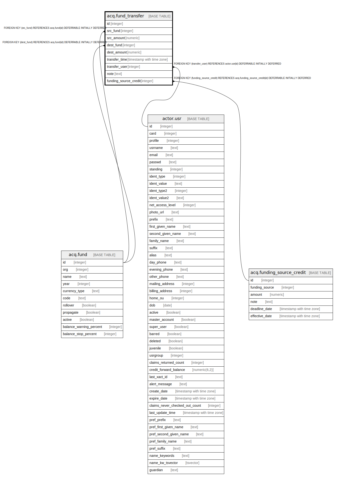

# acq.fund_transfer

## Description

  
Fund Transfer  
Each row represents the transfer of money from a source fund  
to a destination fund.  There should be corresponding entries  
in acq.fund_allocation.  The purpose of acq.fund_transfer is  
to record how much money moved from which fund to which other  
fund.  
  
The presence of two amount fields, rather than one, reflects  
the possibility that the two funds are denominated in different  
currencies.  If they use the same currency type, the two  
amounts should be the same.  

## Columns

| Name | Type | Default | Nullable | Children | Parents | Comment |
| ---- | ---- | ------- | -------- | -------- | ------- | ------- |
| id | integer | nextval('acq.fund_transfer_id_seq'::regclass) | false |  |  |  |
| src_fund | integer |  | false |  | [acq.fund](acq.fund.md) |  |
| src_amount | numeric |  | false |  |  |  |
| dest_fund | integer |  | true |  | [acq.fund](acq.fund.md) |  |
| dest_amount | numeric |  | true |  |  |  |
| transfer_time | timestamp with time zone | now() | false |  |  |  |
| transfer_user | integer |  | false |  | [actor.usr](actor.usr.md) |  |
| note | text |  | true |  |  |  |
| funding_source_credit | integer |  | false |  | [acq.funding_source_credit](acq.funding_source_credit.md) |  |

## Constraints

| Name | Type | Definition |
| ---- | ---- | ---------- |
| fund_transfer_dest_fund_fkey | FOREIGN KEY | FOREIGN KEY (dest_fund) REFERENCES acq.fund(id) DEFERRABLE INITIALLY DEFERRED |
| fund_transfer_src_fund_fkey | FOREIGN KEY | FOREIGN KEY (src_fund) REFERENCES acq.fund(id) DEFERRABLE INITIALLY DEFERRED |
| fund_transfer_pkey | PRIMARY KEY | PRIMARY KEY (id) |
| fund_transfer_funding_source_credit_fkey | FOREIGN KEY | FOREIGN KEY (funding_source_credit) REFERENCES acq.funding_source_credit(id) DEFERRABLE INITIALLY DEFERRED |
| fund_transfer_transfer_user_fkey | FOREIGN KEY | FOREIGN KEY (transfer_user) REFERENCES actor.usr(id) DEFERRABLE INITIALLY DEFERRED |

## Indexes

| Name | Definition |
| ---- | ---------- |
| fund_transfer_pkey | CREATE UNIQUE INDEX fund_transfer_pkey ON acq.fund_transfer USING btree (id) |
| acqftr_usr_idx | CREATE INDEX acqftr_usr_idx ON acq.fund_transfer USING btree (transfer_user) |

## Relations

---

> Generated by [tbls](https://github.com/k1LoW/tbls)
