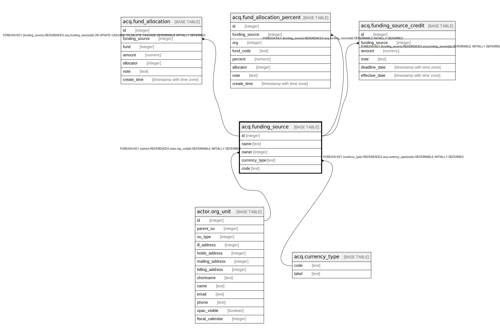

# acq.funding_source

## Description

## Columns

| Name | Type | Default | Nullable | Children | Parents | Comment |
| ---- | ---- | ------- | -------- | -------- | ------- | ------- |
| id | integer | nextval('acq.funding_source_id_seq'::regclass) | false | [acq.fund_allocation](acq.fund_allocation.md) [acq.fund_allocation_percent](acq.fund_allocation_percent.md) [acq.funding_source_credit](acq.funding_source_credit.md) |  |  |
| name | text |  | false |  |  |  |
| owner | integer |  | false |  | [actor.org_unit](actor.org_unit.md) |  |
| currency_type | text |  | false |  | [acq.currency_type](acq.currency_type.md) |  |
| code | text |  | false |  |  |  |

## Constraints

| Name | Type | Definition |
| ---- | ---- | ---------- |
| funding_source_currency_type_fkey | FOREIGN KEY | FOREIGN KEY (currency_type) REFERENCES acq.currency_type(code) DEFERRABLE INITIALLY DEFERRED |
| funding_source_code_once_per_owner | UNIQUE | UNIQUE (code, owner) |
| funding_source_name_once_per_owner | UNIQUE | UNIQUE (name, owner) |
| funding_source_pkey | PRIMARY KEY | PRIMARY KEY (id) |
| funding_source_owner_fkey | FOREIGN KEY | FOREIGN KEY (owner) REFERENCES actor.org_unit(id) DEFERRABLE INITIALLY DEFERRED |

## Indexes

| Name | Definition |
| ---- | ---------- |
| funding_source_code_once_per_owner | CREATE UNIQUE INDEX funding_source_code_once_per_owner ON acq.funding_source USING btree (code, owner) |
| funding_source_name_once_per_owner | CREATE UNIQUE INDEX funding_source_name_once_per_owner ON acq.funding_source USING btree (name, owner) |
| funding_source_pkey | CREATE UNIQUE INDEX funding_source_pkey ON acq.funding_source USING btree (id) |

## Relations

---

> Generated by [tbls](https://github.com/k1LoW/tbls)
