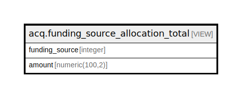

# acq.funding_source_allocation_total

## Description

<details>
<summary><strong>Table Definition</strong></summary>

```sql
CREATE VIEW funding_source_allocation_total AS (
 SELECT a.funding_source,
    (sum(a.amount))::numeric(100,2) AS amount
   FROM acq.fund_allocation a
  GROUP BY a.funding_source
)
```

</details>

## Columns

| Name | Type | Default | Nullable | Children | Parents | Comment |
| ---- | ---- | ------- | -------- | -------- | ------- | ------- |
| funding_source | integer |  | true |  |  |  |
| amount | numeric(100,2) |  | true |  |  |  |

## Referenced Tables

| Name | Columns | Comment | Type |
| ---- | ------- | ------- | ---- |
| [acq.fund_allocation](acq.fund_allocation.md) | 7 |  | BASE TABLE |

## Relations



---

> Generated by [tbls](https://github.com/k1LoW/tbls)
