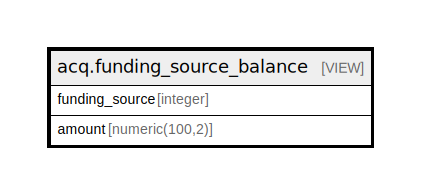

# acq.funding_source_balance

## Description

<details>
<summary><strong>Table Definition</strong></summary>

```sql
CREATE VIEW funding_source_balance AS (
 SELECT COALESCE(c.funding_source, a.funding_source) AS funding_source,
    (sum((COALESCE(c.amount, 0.0) - COALESCE(a.amount, 0.0))))::numeric(100,2) AS amount
   FROM (acq.funding_source_credit_total c
     FULL JOIN acq.funding_source_allocation_total a USING (funding_source))
  GROUP BY COALESCE(c.funding_source, a.funding_source)
)
```

</details>

## Columns

| Name | Type | Default | Nullable | Children | Parents | Comment |
| ---- | ---- | ------- | -------- | -------- | ------- | ------- |
| funding_source | integer |  | true |  |  |  |
| amount | numeric(100,2) |  | true |  |  |  |

## Referenced Tables

| Name | Columns | Comment | Type |
| ---- | ------- | ------- | ---- |
| [acq.funding_source_credit_total](acq.funding_source_credit_total.md) | 2 |  | VIEW |
| [acq.funding_source_allocation_total](acq.funding_source_allocation_total.md) | 2 |  | VIEW |

## Relations



---

> Generated by [tbls](https://github.com/k1LoW/tbls)
