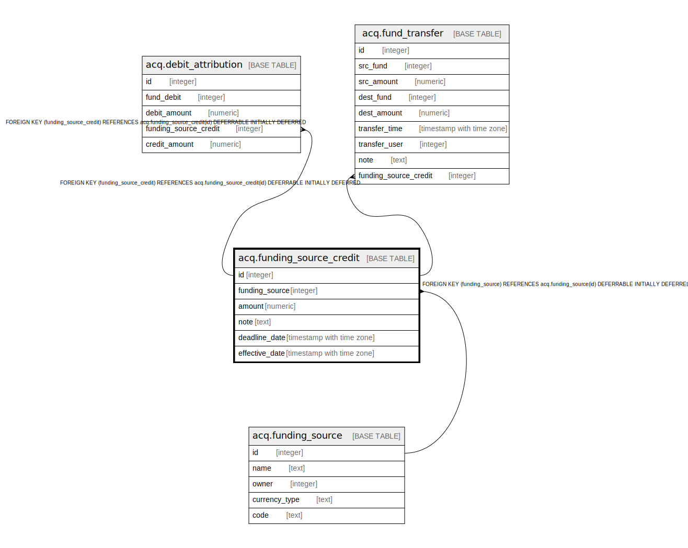

# acq.funding_source_credit

## Description

## Columns

| Name | Type | Default | Nullable | Children | Parents | Comment |
| ---- | ---- | ------- | -------- | -------- | ------- | ------- |
| id | integer | nextval('acq.funding_source_credit_id_seq'::regclass) | false | [acq.debit_attribution](acq.debit_attribution.md) [acq.fund_transfer](acq.fund_transfer.md) |  |  |
| funding_source | integer |  | false |  | [acq.funding_source](acq.funding_source.md) |  |
| amount | numeric |  | false |  |  |  |
| note | text |  | true |  |  |  |
| deadline_date | timestamp with time zone |  | true |  |  |  |
| effective_date | timestamp with time zone | now() | false |  |  |  |

## Constraints

| Name | Type | Definition |
| ---- | ---- | ---------- |
| funding_source_credit_pkey | PRIMARY KEY | PRIMARY KEY (id) |
| funding_source_credit_funding_source_fkey | FOREIGN KEY | FOREIGN KEY (funding_source) REFERENCES acq.funding_source(id) DEFERRABLE INITIALLY DEFERRED |

## Indexes

| Name | Definition |
| ---- | ---------- |
| funding_source_credit_pkey | CREATE UNIQUE INDEX funding_source_credit_pkey ON acq.funding_source_credit USING btree (id) |

## Relations

---

> Generated by [tbls](https://github.com/k1LoW/tbls)
