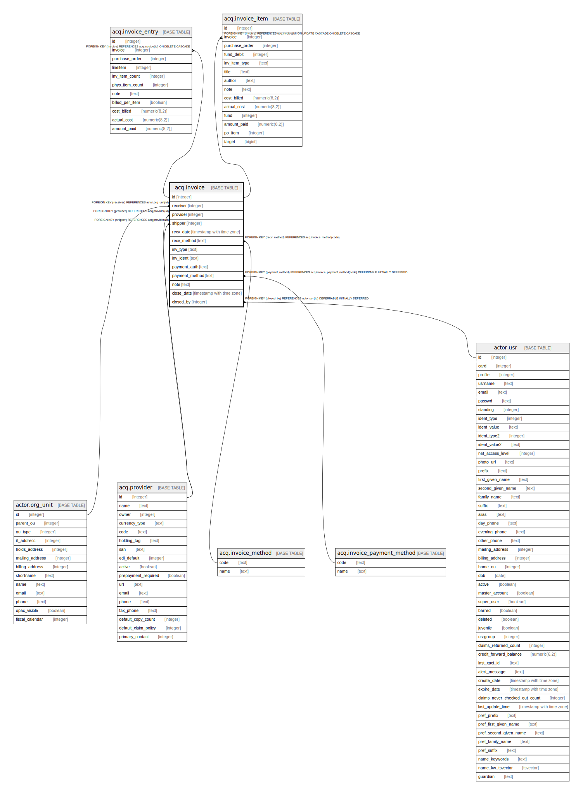

# acq.invoice

## Description

## Columns

| Name | Type | Default | Nullable | Children | Parents | Comment |
| ---- | ---- | ------- | -------- | -------- | ------- | ------- |
| id | integer | nextval('acq.invoice_id_seq'::regclass) | false | [acq.invoice_entry](acq.invoice_entry.md) [acq.invoice_item](acq.invoice_item.md) |  |  |
| receiver | integer |  | false |  | [actor.org_unit](actor.org_unit.md) |  |
| provider | integer |  | false |  | [acq.provider](acq.provider.md) |  |
| shipper | integer |  | false |  | [acq.provider](acq.provider.md) |  |
| recv_date | timestamp with time zone | now() | false |  |  |  |
| recv_method | text | 'EDI'::text | false |  | [acq.invoice_method](acq.invoice_method.md) |  |
| inv_type | text |  | true |  |  |  |
| inv_ident | text |  | false |  |  |  |
| payment_auth | text |  | true |  |  |  |
| payment_method | text |  | true |  | [acq.invoice_payment_method](acq.invoice_payment_method.md) |  |
| note | text |  | true |  |  |  |
| close_date | timestamp with time zone |  | true |  |  |  |
| closed_by | integer |  | true |  | [actor.usr](actor.usr.md) |  |

## Constraints

| Name | Type | Definition |
| ---- | ---- | ---------- |
| inv_ident_once_per_provider | UNIQUE | UNIQUE (provider, inv_ident) |
| invoice_recv_method_fkey | FOREIGN KEY | FOREIGN KEY (recv_method) REFERENCES acq.invoice_method(code) |
| invoice_payment_method_fkey | FOREIGN KEY | FOREIGN KEY (payment_method) REFERENCES acq.invoice_payment_method(code) DEFERRABLE INITIALLY DEFERRED |
| invoice_pkey | PRIMARY KEY | PRIMARY KEY (id) |
| invoice_provider_fkey | FOREIGN KEY | FOREIGN KEY (provider) REFERENCES acq.provider(id) |
| invoice_shipper_fkey | FOREIGN KEY | FOREIGN KEY (shipper) REFERENCES acq.provider(id) |
| invoice_receiver_fkey | FOREIGN KEY | FOREIGN KEY (receiver) REFERENCES actor.org_unit(id) |
| invoice_closed_by_fkey | FOREIGN KEY | FOREIGN KEY (closed_by) REFERENCES actor.usr(id) DEFERRABLE INITIALLY DEFERRED |

## Indexes

| Name | Definition |
| ---- | ---------- |
| inv_ident_once_per_provider | CREATE UNIQUE INDEX inv_ident_once_per_provider ON acq.invoice USING btree (provider, inv_ident) |
| invoice_pkey | CREATE UNIQUE INDEX invoice_pkey ON acq.invoice USING btree (id) |

## Triggers

| Name | Definition |
| ---- | ---------- |
| audit_acq_invoice_update_trigger | CREATE TRIGGER audit_acq_invoice_update_trigger AFTER DELETE OR UPDATE ON acq.invoice FOR EACH ROW EXECUTE PROCEDURE auditor.audit_acq_invoice_func() |

## Relations

---

> Generated by [tbls](https://github.com/k1LoW/tbls)
