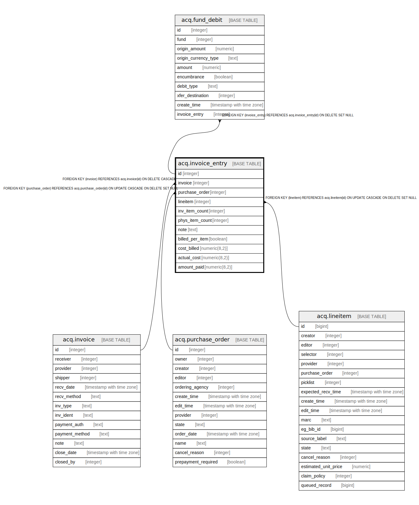

# acq.invoice_entry

## Description

## Columns

| Name | Type | Default | Nullable | Children | Parents | Comment |
| ---- | ---- | ------- | -------- | -------- | ------- | ------- |
| id | integer | nextval('acq.invoice_entry_id_seq'::regclass) | false | [acq.fund_debit](acq.fund_debit.md) |  |  |
| invoice | integer |  | false |  | [acq.invoice](acq.invoice.md) |  |
| purchase_order | integer |  | true |  | [acq.purchase_order](acq.purchase_order.md) |  |
| lineitem | integer |  | true |  | [acq.lineitem](acq.lineitem.md) |  |
| inv_item_count | integer |  | false |  |  |  |
| phys_item_count | integer |  | true |  |  |  |
| note | text |  | true |  |  |  |
| billed_per_item | boolean |  | true |  |  |  |
| cost_billed | numeric(8,2) |  | true |  |  |  |
| actual_cost | numeric(8,2) |  | true |  |  |  |
| amount_paid | numeric(8,2) |  | true |  |  |  |

## Constraints

| Name | Type | Definition |
| ---- | ---- | ---------- |
| invoice_entry_pkey | PRIMARY KEY | PRIMARY KEY (id) |
| invoice_entry_invoice_fkey | FOREIGN KEY | FOREIGN KEY (invoice) REFERENCES acq.invoice(id) ON DELETE CASCADE |
| invoice_entry_lineitem_fkey | FOREIGN KEY | FOREIGN KEY (lineitem) REFERENCES acq.lineitem(id) ON UPDATE CASCADE ON DELETE SET NULL |
| invoice_entry_purchase_order_fkey | FOREIGN KEY | FOREIGN KEY (purchase_order) REFERENCES acq.purchase_order(id) ON UPDATE CASCADE ON DELETE SET NULL |

## Indexes

| Name | Definition |
| ---- | ---------- |
| invoice_entry_pkey | CREATE UNIQUE INDEX invoice_entry_pkey ON acq.invoice_entry USING btree (id) |
| ie_inv_idx | CREATE INDEX ie_inv_idx ON acq.invoice_entry USING btree (invoice) |
| ie_li_idx | CREATE INDEX ie_li_idx ON acq.invoice_entry USING btree (lineitem) |
| ie_po_idx | CREATE INDEX ie_po_idx ON acq.invoice_entry USING btree (purchase_order) |

## Triggers

| Name | Definition |
| ---- | ---------- |
| audit_acq_invoice_entry_update_trigger | CREATE TRIGGER audit_acq_invoice_entry_update_trigger AFTER DELETE OR UPDATE ON acq.invoice_entry FOR EACH ROW EXECUTE PROCEDURE auditor.audit_acq_invoice_entry_func() |

## Relations

---

> Generated by [tbls](https://github.com/k1LoW/tbls)
