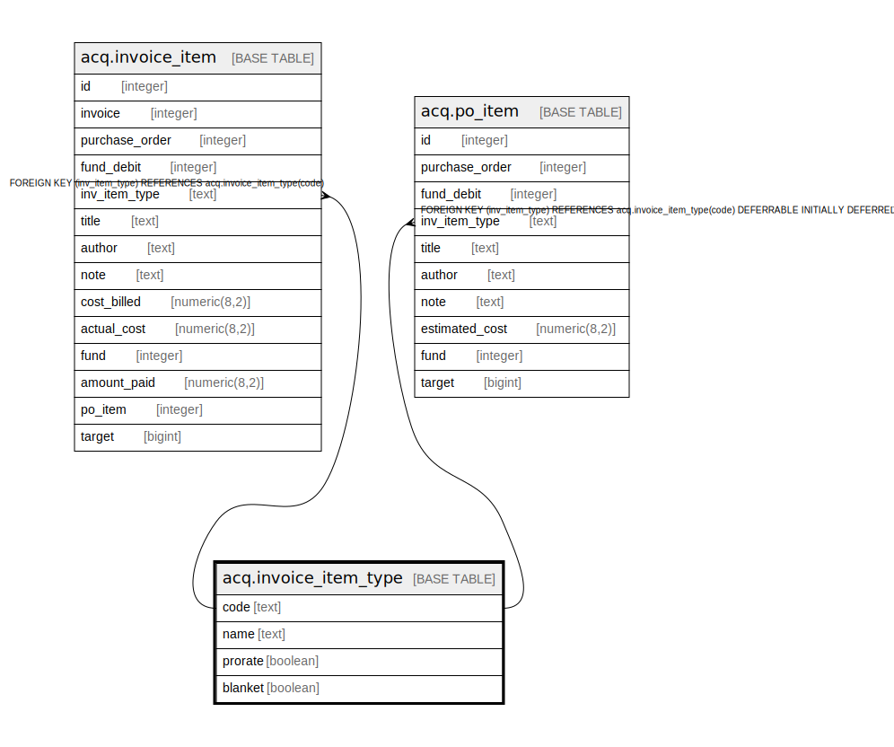

# acq.invoice_item_type

## Description

## Columns

| Name | Type | Default | Nullable | Children | Parents | Comment |
| ---- | ---- | ------- | -------- | -------- | ------- | ------- |
| code | text |  | false | [acq.invoice_item](acq.invoice_item.md) [acq.po_item](acq.po_item.md) |  |  |
| name | text |  | false |  |  |  |
| prorate | boolean | false | false |  |  |  |
| blanket | boolean | false | false |  |  |  |

## Constraints

| Name | Type | Definition |
| ---- | ---- | ---------- |
| aiit_not_blanket_and_prorate | CHECK | CHECK (((blanket IS FALSE) OR (prorate IS FALSE))) |
| invoice_item_type_pkey | PRIMARY KEY | PRIMARY KEY (code) |

## Indexes

| Name | Definition |
| ---- | ---------- |
| invoice_item_type_pkey | CREATE UNIQUE INDEX invoice_item_type_pkey ON acq.invoice_item_type USING btree (code) |

## Relations

---

> Generated by [tbls](https://github.com/k1LoW/tbls)
