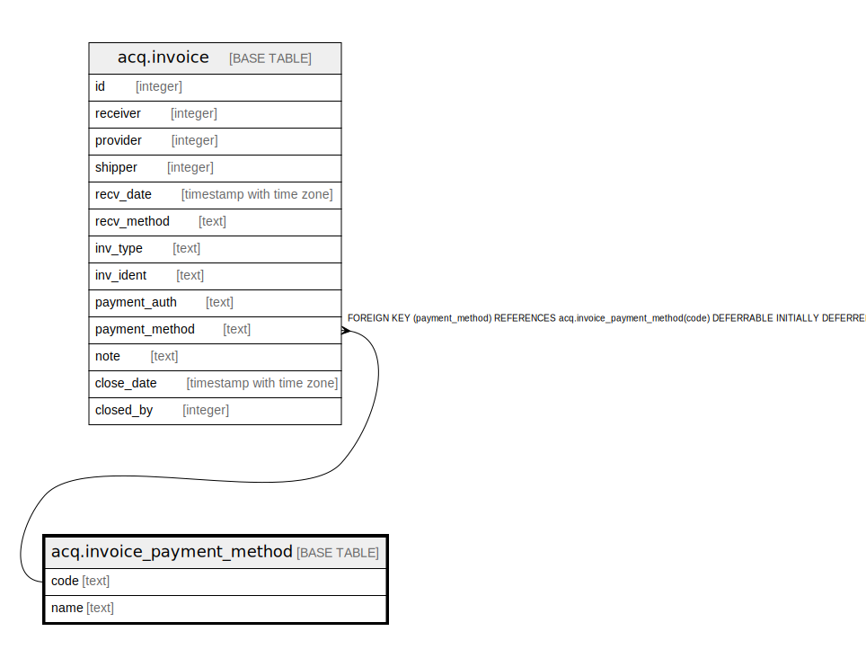

# acq.invoice_payment_method

## Description

## Columns

| Name | Type | Default | Nullable | Children | Parents | Comment |
| ---- | ---- | ------- | -------- | -------- | ------- | ------- |
| code | text |  | false | [acq.invoice](acq.invoice.md) |  |  |
| name | text |  | false |  |  |  |

## Constraints

| Name | Type | Definition |
| ---- | ---- | ---------- |
| invoice_payment_method_pkey | PRIMARY KEY | PRIMARY KEY (code) |

## Indexes

| Name | Definition |
| ---- | ---------- |
| invoice_payment_method_pkey | CREATE UNIQUE INDEX invoice_payment_method_pkey ON acq.invoice_payment_method USING btree (code) |

## Relations

---

> Generated by [tbls](https://github.com/k1LoW/tbls)
