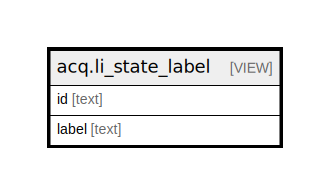

# acq.li_state_label

## Description

<details>
<summary><strong>Table Definition</strong></summary>

```sql
CREATE VIEW li_state_label AS (
 SELECT t.id,
    t.label
   FROM ( VALUES ('new'::text,'New'::text), ('selector-ready'::text,'Selector-Ready'::text), ('order-ready'::text,'Order-Ready'::text), ('approved'::text,'Approved'::text), ('pending-order'::text,'Pending-Order'::text), ('on-order'::text,'On-Order'::text), ('received'::text,'Received'::text), ('cancelled'::text,'Cancelled'::text)) t(id, label)
)
```

</details>

## Columns

| Name | Type | Default | Nullable | Children | Parents | Comment |
| ---- | ---- | ------- | -------- | -------- | ------- | ------- |
| id | text |  | true |  |  |  |
| label | text |  | true |  |  |  |

## Referenced Tables

| Name | Columns | Comment | Type |
| ---- | ------- | ------- | ---- |
| [VALUES](VALUES.md) | 0 |  |  |

## Relations



---

> Generated by [tbls](https://github.com/k1LoW/tbls)
