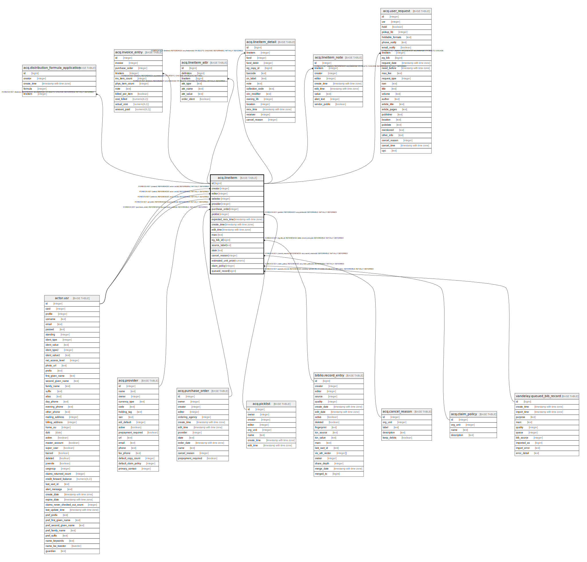

# acq.lineitem

## Description

## Columns

| Name | Type | Default | Nullable | Children | Parents | Comment |
| ---- | ---- | ------- | -------- | -------- | ------- | ------- |
| id | bigint | nextval('acq.lineitem_id_seq'::regclass) | false | [acq.distribution_formula_application](acq.distribution_formula_application.md) [acq.invoice_entry](acq.invoice_entry.md) [acq.lineitem_attr](acq.lineitem_attr.md) [acq.lineitem_detail](acq.lineitem_detail.md) [acq.lineitem_note](acq.lineitem_note.md) [acq.user_request](acq.user_request.md) |  |  |
| creator | integer |  | false |  | [actor.usr](actor.usr.md) |  |
| editor | integer |  | false |  | [actor.usr](actor.usr.md) |  |
| selector | integer |  | false |  | [actor.usr](actor.usr.md) |  |
| provider | integer |  | true |  | [acq.provider](acq.provider.md) |  |
| purchase_order | integer |  | true |  | [acq.purchase_order](acq.purchase_order.md) |  |
| picklist | integer |  | true |  | [acq.picklist](acq.picklist.md) |  |
| expected_recv_time | timestamp with time zone |  | true |  |  |  |
| create_time | timestamp with time zone | now() | false |  |  |  |
| edit_time | timestamp with time zone | now() | false |  |  |  |
| marc | text |  | false |  |  |  |
| eg_bib_id | bigint |  | true |  | [biblio.record_entry](biblio.record_entry.md) |  |
| source_label | text |  | true |  |  |  |
| state | text | 'new'::text | false |  |  |  |
| cancel_reason | integer |  | true |  | [acq.cancel_reason](acq.cancel_reason.md) |  |
| estimated_unit_price | numeric |  | true |  |  |  |
| claim_policy | integer |  | true |  | [acq.claim_policy](acq.claim_policy.md) |  |
| queued_record | bigint |  | true |  | [vandelay.queued_bib_record](vandelay.queued_bib_record.md) |  |

## Constraints

| Name | Type | Definition |
| ---- | ---- | ---------- |
| picklist_or_po | CHECK | CHECK (((picklist IS NOT NULL) OR (purchase_order IS NOT NULL))) |
| lineitem_cancel_reason_fkey | FOREIGN KEY | FOREIGN KEY (cancel_reason) REFERENCES acq.cancel_reason(id) DEFERRABLE INITIALLY DEFERRED |
| lineitem_claim_policy_fkey | FOREIGN KEY | FOREIGN KEY (claim_policy) REFERENCES acq.claim_policy(id) DEFERRABLE INITIALLY DEFERRED |
| lineitem_pkey | PRIMARY KEY | PRIMARY KEY (id) |
| lineitem_picklist_fkey | FOREIGN KEY | FOREIGN KEY (picklist) REFERENCES acq.picklist(id) DEFERRABLE INITIALLY DEFERRED |
| lineitem_provider_fkey | FOREIGN KEY | FOREIGN KEY (provider) REFERENCES acq.provider(id) DEFERRABLE INITIALLY DEFERRED |
| lineitem_purchase_order_fkey | FOREIGN KEY | FOREIGN KEY (purchase_order) REFERENCES acq.purchase_order(id) DEFERRABLE INITIALLY DEFERRED |
| lineitem_creator_fkey | FOREIGN KEY | FOREIGN KEY (creator) REFERENCES actor.usr(id) DEFERRABLE INITIALLY DEFERRED |
| lineitem_editor_fkey | FOREIGN KEY | FOREIGN KEY (editor) REFERENCES actor.usr(id) DEFERRABLE INITIALLY DEFERRED |
| lineitem_selector_fkey | FOREIGN KEY | FOREIGN KEY (selector) REFERENCES actor.usr(id) DEFERRABLE INITIALLY DEFERRED |
| lineitem_eg_bib_id_fkey | FOREIGN KEY | FOREIGN KEY (eg_bib_id) REFERENCES biblio.record_entry(id) DEFERRABLE INITIALLY DEFERRED |
| lineitem_queued_record_fkey | FOREIGN KEY | FOREIGN KEY (queued_record) REFERENCES vandelay.queued_bib_record(id) ON DELETE SET NULL DEFERRABLE INITIALLY DEFERRED |

## Indexes

| Name | Definition |
| ---- | ---------- |
| lineitem_pkey | CREATE UNIQUE INDEX lineitem_pkey ON acq.lineitem USING btree (id) |
| li_creator_idx | CREATE INDEX li_creator_idx ON acq.lineitem USING btree (creator) |
| li_editor_idx | CREATE INDEX li_editor_idx ON acq.lineitem USING btree (editor) |
| li_pl_idx | CREATE INDEX li_pl_idx ON acq.lineitem USING btree (picklist) |
| li_po_idx | CREATE INDEX li_po_idx ON acq.lineitem USING btree (purchase_order) |
| li_queued_record_idx | CREATE INDEX li_queued_record_idx ON acq.lineitem USING btree (queued_record) |
| li_selector_idx | CREATE INDEX li_selector_idx ON acq.lineitem USING btree (selector) |

## Triggers

| Name | Definition |
| ---- | ---------- |
| audit_acq_lineitem_update_trigger | CREATE TRIGGER audit_acq_lineitem_update_trigger AFTER DELETE OR UPDATE ON acq.lineitem FOR EACH ROW EXECUTE PROCEDURE acq.audit_acq_lineitem_func() |
| cleanup_lineitem_trigger | CREATE TRIGGER cleanup_lineitem_trigger BEFORE DELETE OR UPDATE ON acq.lineitem FOR EACH ROW EXECUTE PROCEDURE cleanup_acq_marc() |
| ingest_lineitem_trigger | CREATE TRIGGER ingest_lineitem_trigger AFTER INSERT OR UPDATE ON acq.lineitem FOR EACH ROW EXECUTE PROCEDURE ingest_acq_marc() |

## Relations

---

> Generated by [tbls](https://github.com/k1LoW/tbls)
