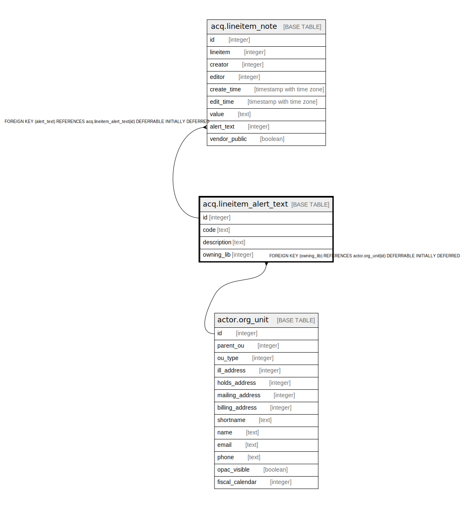

# acq.lineitem_alert_text

## Description

## Columns

| Name | Type | Default | Nullable | Children | Parents | Comment |
| ---- | ---- | ------- | -------- | -------- | ------- | ------- |
| id | integer | nextval('acq.lineitem_alert_text_id_seq'::regclass) | false | [acq.lineitem_note](acq.lineitem_note.md) |  |  |
| code | text |  | false |  |  |  |
| description | text |  | true |  |  |  |
| owning_lib | integer |  | false |  | [actor.org_unit](actor.org_unit.md) |  |

## Constraints

| Name | Type | Definition |
| ---- | ---- | ---------- |
| alert_one_code_per_org | UNIQUE | UNIQUE (code, owning_lib) |
| lineitem_alert_text_pkey | PRIMARY KEY | PRIMARY KEY (id) |
| lineitem_alert_text_owning_lib_fkey | FOREIGN KEY | FOREIGN KEY (owning_lib) REFERENCES actor.org_unit(id) DEFERRABLE INITIALLY DEFERRED |

## Indexes

| Name | Definition |
| ---- | ---------- |
| alert_one_code_per_org | CREATE UNIQUE INDEX alert_one_code_per_org ON acq.lineitem_alert_text USING btree (code, owning_lib) |
| lineitem_alert_text_pkey | CREATE UNIQUE INDEX lineitem_alert_text_pkey ON acq.lineitem_alert_text USING btree (id) |

## Relations

---

> Generated by [tbls](https://github.com/k1LoW/tbls)
