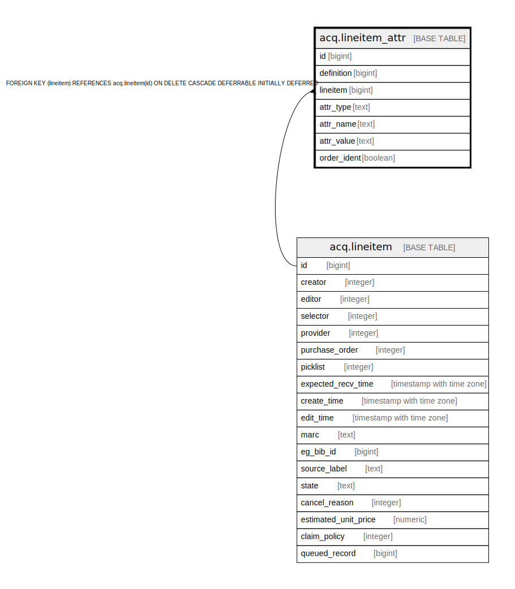

# acq.lineitem_attr

## Description

## Columns

| Name | Type | Default | Nullable | Children | Parents | Comment |
| ---- | ---- | ------- | -------- | -------- | ------- | ------- |
| id | bigint | nextval('acq.lineitem_attr_id_seq'::regclass) | false |  |  |  |
| definition | bigint |  | false |  |  |  |
| lineitem | bigint |  | false |  | [acq.lineitem](acq.lineitem.md) |  |
| attr_type | text |  | false |  |  |  |
| attr_name | text |  | false |  |  |  |
| attr_value | text |  | false |  |  |  |
| order_ident | boolean | false | false |  |  |  |

## Constraints

| Name | Type | Definition |
| ---- | ---- | ---------- |
| lineitem_attr_pkey | PRIMARY KEY | PRIMARY KEY (id) |
| lineitem_attr_lineitem_fkey | FOREIGN KEY | FOREIGN KEY (lineitem) REFERENCES acq.lineitem(id) ON DELETE CASCADE DEFERRABLE INITIALLY DEFERRED |

## Indexes

| Name | Definition |
| ---- | ---------- |
| lineitem_attr_pkey | CREATE UNIQUE INDEX lineitem_attr_pkey ON acq.lineitem_attr USING btree (id) |
| li_attr_definition_idx | CREATE INDEX li_attr_definition_idx ON acq.lineitem_attr USING btree (definition) |
| li_attr_li_idx | CREATE INDEX li_attr_li_idx ON acq.lineitem_attr USING btree (lineitem) |
| li_attr_value_idx | CREATE INDEX li_attr_value_idx ON acq.lineitem_attr USING btree (attr_value) |

## Relations

---

> Generated by [tbls](https://github.com/k1LoW/tbls)
