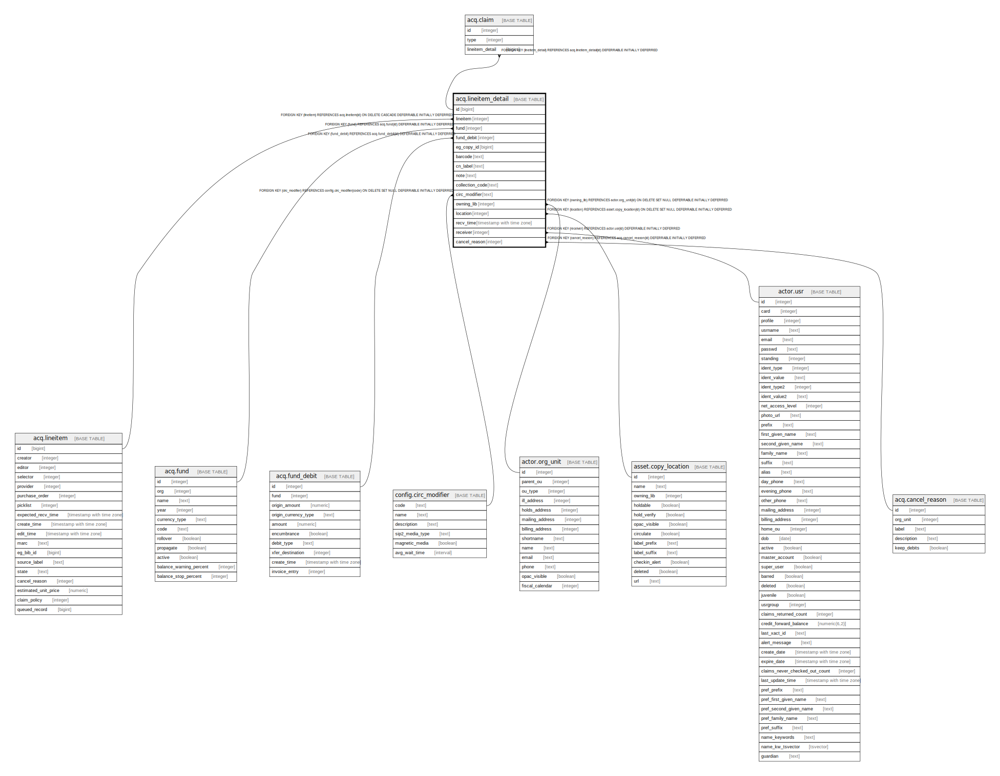

# acq.lineitem_detail

## Description

## Columns

| Name | Type | Default | Nullable | Children | Parents | Comment |
| ---- | ---- | ------- | -------- | -------- | ------- | ------- |
| id | bigint | nextval('acq.lineitem_detail_id_seq'::regclass) | false | [acq.claim](acq.claim.md) |  |  |
| lineitem | integer |  | false |  | [acq.lineitem](acq.lineitem.md) |  |
| fund | integer |  | true |  | [acq.fund](acq.fund.md) |  |
| fund_debit | integer |  | true |  | [acq.fund_debit](acq.fund_debit.md) |  |
| eg_copy_id | bigint |  | true |  |  |  |
| barcode | text |  | true |  |  |  |
| cn_label | text |  | true |  |  |  |
| note | text |  | true |  |  |  |
| collection_code | text |  | true |  |  |  |
| circ_modifier | text |  | true |  | [config.circ_modifier](config.circ_modifier.md) |  |
| owning_lib | integer |  | true |  | [actor.org_unit](actor.org_unit.md) |  |
| location | integer |  | true |  | [asset.copy_location](asset.copy_location.md) |  |
| recv_time | timestamp with time zone |  | true |  |  |  |
| receiver | integer |  | true |  | [actor.usr](actor.usr.md) |  |
| cancel_reason | integer |  | true |  | [acq.cancel_reason](acq.cancel_reason.md) |  |

## Constraints

| Name | Type | Definition |
| ---- | ---- | ---------- |
| lineitem_detail_cancel_reason_fkey | FOREIGN KEY | FOREIGN KEY (cancel_reason) REFERENCES acq.cancel_reason(id) DEFERRABLE INITIALLY DEFERRED |
| lineitem_detail_fund_debit_fkey | FOREIGN KEY | FOREIGN KEY (fund_debit) REFERENCES acq.fund_debit(id) DEFERRABLE INITIALLY DEFERRED |
| lineitem_detail_fund_fkey | FOREIGN KEY | FOREIGN KEY (fund) REFERENCES acq.fund(id) DEFERRABLE INITIALLY DEFERRED |
| lineitem_detail_pkey | PRIMARY KEY | PRIMARY KEY (id) |
| lineitem_detail_lineitem_fkey | FOREIGN KEY | FOREIGN KEY (lineitem) REFERENCES acq.lineitem(id) ON DELETE CASCADE DEFERRABLE INITIALLY DEFERRED |
| lineitem_detail_owning_lib_fkey | FOREIGN KEY | FOREIGN KEY (owning_lib) REFERENCES actor.org_unit(id) ON DELETE SET NULL DEFERRABLE INITIALLY DEFERRED |
| lineitem_detail_receiver_fkey | FOREIGN KEY | FOREIGN KEY (receiver) REFERENCES actor.usr(id) DEFERRABLE INITIALLY DEFERRED |
| lineitem_detail_location_fkey | FOREIGN KEY | FOREIGN KEY (location) REFERENCES asset.copy_location(id) ON DELETE SET NULL DEFERRABLE INITIALLY DEFERRED |
| lineitem_detail_circ_modifier_fkey | FOREIGN KEY | FOREIGN KEY (circ_modifier) REFERENCES config.circ_modifier(code) ON DELETE SET NULL DEFERRABLE INITIALLY DEFERRED |

## Indexes

| Name | Definition |
| ---- | ---------- |
| lineitem_detail_pkey | CREATE UNIQUE INDEX lineitem_detail_pkey ON acq.lineitem_detail USING btree (id) |
| li_detail_li_idx | CREATE INDEX li_detail_li_idx ON acq.lineitem_detail USING btree (lineitem) |
| lineitem_detail_fund_debit_idx | CREATE INDEX lineitem_detail_fund_debit_idx ON acq.lineitem_detail USING btree (fund_debit) |

## Relations

---

> Generated by [tbls](https://github.com/k1LoW/tbls)
