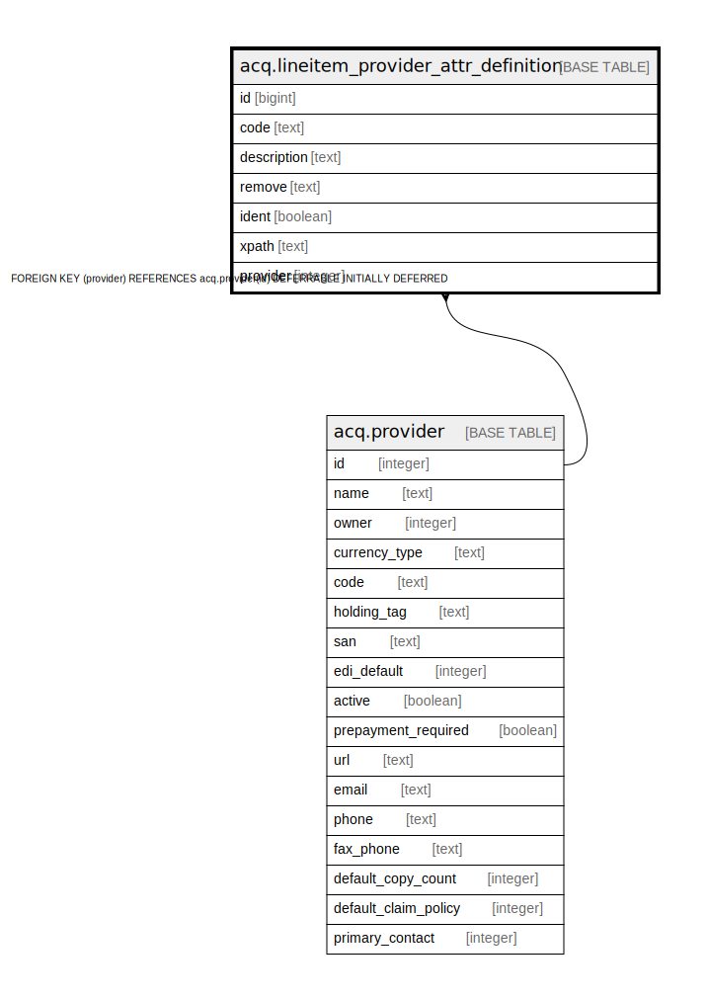

# acq.lineitem_provider_attr_definition

## Description

## Columns

| Name | Type | Default | Nullable | Children | Parents | Comment |
| ---- | ---- | ------- | -------- | -------- | ------- | ------- |
| id | bigint | nextval('acq.lineitem_attr_definition_id_seq'::regclass) | false |  |  |  |
| code | text |  | false |  |  |  |
| description | text |  | false |  |  |  |
| remove | text | ''::text | false |  |  |  |
| ident | boolean | false | false |  |  |  |
| xpath | text |  | false |  |  |  |
| provider | integer |  | false |  | [acq.provider](acq.provider.md) |  |

## Constraints

| Name | Type | Definition |
| ---- | ---- | ---------- |
| lineitem_provider_attr_definition_pkey | PRIMARY KEY | PRIMARY KEY (id) |
| lineitem_provider_attr_definition_provider_fkey | FOREIGN KEY | FOREIGN KEY (provider) REFERENCES acq.provider(id) DEFERRABLE INITIALLY DEFERRED |

## Indexes

| Name | Definition |
| ---- | ---------- |
| lineitem_provider_attr_definition_pkey | CREATE UNIQUE INDEX lineitem_provider_attr_definition_pkey ON acq.lineitem_provider_attr_definition USING btree (id) |

## Relations

---

> Generated by [tbls](https://github.com/k1LoW/tbls)
