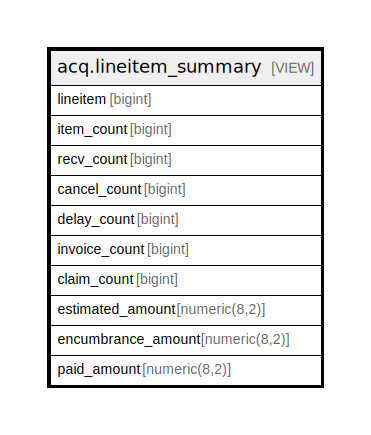

# acq.lineitem_summary

## Description

<details>
<summary><strong>Table Definition</strong></summary>

```sql
CREATE VIEW lineitem_summary AS (
 SELECT li.id AS lineitem,
    ( SELECT count(lid.id) AS count
           FROM acq.lineitem_detail lid
          WHERE (lid.lineitem = li.id)) AS item_count,
    ( SELECT count(lid.id) AS count
           FROM acq.lineitem_detail lid
          WHERE ((lid.recv_time IS NOT NULL) AND (lid.lineitem = li.id))) AS recv_count,
    ( SELECT count(lid.id) AS count
           FROM (acq.lineitem_detail lid
             JOIN acq.cancel_reason acqcr ON ((acqcr.id = lid.cancel_reason)))
          WHERE ((acqcr.keep_debits IS FALSE) AND (lid.lineitem = li.id))) AS cancel_count,
    ( SELECT count(lid.id) AS count
           FROM (acq.lineitem_detail lid
             JOIN acq.cancel_reason acqcr ON ((acqcr.id = lid.cancel_reason)))
          WHERE ((acqcr.keep_debits IS TRUE) AND (lid.lineitem = li.id))) AS delay_count,
    ( SELECT count(lid.id) AS count
           FROM (acq.lineitem_detail lid
             JOIN acq.fund_debit debit ON ((lid.fund_debit = debit.id)))
          WHERE ((NOT debit.encumbrance) AND (lid.lineitem = li.id))) AS invoice_count,
    ( SELECT count(DISTINCT lid.id) AS count
           FROM (acq.lineitem_detail lid
             JOIN acq.claim claim ON ((claim.lineitem_detail = lid.id)))
          WHERE (lid.lineitem = li.id)) AS claim_count,
    ( SELECT (((count(lid.id))::numeric * li.estimated_unit_price))::numeric(8,2) AS "numeric"
           FROM acq.lineitem_detail lid
          WHERE ((lid.cancel_reason IS NULL) AND (lid.lineitem = li.id))) AS estimated_amount,
    ( SELECT (sum(debit.amount))::numeric(8,2) AS sum
           FROM (acq.lineitem_detail lid
             JOIN acq.fund_debit debit ON ((lid.fund_debit = debit.id)))
          WHERE (debit.encumbrance AND (lid.lineitem = li.id))) AS encumbrance_amount,
    ( SELECT (sum(debit.amount))::numeric(8,2) AS sum
           FROM (acq.lineitem_detail lid
             JOIN acq.fund_debit debit ON ((lid.fund_debit = debit.id)))
          WHERE ((NOT debit.encumbrance) AND (lid.lineitem = li.id))) AS paid_amount
   FROM acq.lineitem li
)
```

</details>

## Columns

| Name | Type | Default | Nullable | Children | Parents | Comment |
| ---- | ---- | ------- | -------- | -------- | ------- | ------- |
| lineitem | bigint |  | true |  |  |  |
| item_count | bigint |  | true |  |  |  |
| recv_count | bigint |  | true |  |  |  |
| cancel_count | bigint |  | true |  |  |  |
| delay_count | bigint |  | true |  |  |  |
| invoice_count | bigint |  | true |  |  |  |
| claim_count | bigint |  | true |  |  |  |
| estimated_amount | numeric(8,2) |  | true |  |  |  |
| encumbrance_amount | numeric(8,2) |  | true |  |  |  |
| paid_amount | numeric(8,2) |  | true |  |  |  |

## Referenced Tables

| Name | Columns | Comment | Type |
| ---- | ------- | ------- | ---- |
| [acq.lineitem_detail](acq.lineitem_detail.md) | 15 |  | BASE TABLE |
| [acq.cancel_reason](acq.cancel_reason.md) | 5 |  | BASE TABLE |
| [acq.fund_debit](acq.fund_debit.md) | 10 |  | BASE TABLE |
| [acq.claim](acq.claim.md) | 3 |  | BASE TABLE |
| [acq.lineitem](acq.lineitem.md) | 18 |  | BASE TABLE |

## Relations



---

> Generated by [tbls](https://github.com/k1LoW/tbls)
