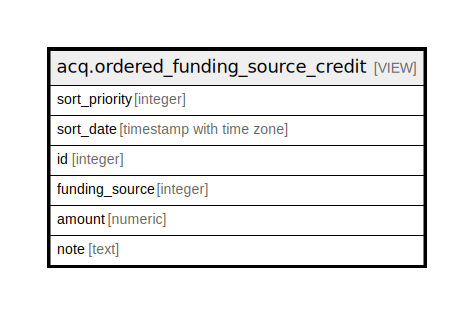

# acq.ordered_funding_source_credit

## Description

  
The acq.ordered_funding_source_credit view is a prioritized  
ordering of funding source credits.  When ordered by the first  
three columns, this view defines the order in which the various  
credits are to be tapped for spending, subject to the allocations  
in the acq.fund_allocation table.  
  
The first column reflects the principle that we should spend  
money with deadlines before spending money without deadlines.  
  
The second column reflects the principle that we should spend the  
oldest money first.  For money with deadlines, that means that we  
spend first from the credit with the earliest deadline.  For  
money without deadlines, we spend first from the credit with the  
earliest effective date.  
  
The third column is a tie breaker to ensure a consistent  
ordering.  


<details>
<summary><strong>Table Definition</strong></summary>

```sql
CREATE VIEW ordered_funding_source_credit AS (
 SELECT
        CASE
            WHEN (funding_source_credit.deadline_date IS NULL) THEN 2
            ELSE 1
        END AS sort_priority,
        CASE
            WHEN (funding_source_credit.deadline_date IS NULL) THEN funding_source_credit.effective_date
            ELSE funding_source_credit.deadline_date
        END AS sort_date,
    funding_source_credit.id,
    funding_source_credit.funding_source,
    funding_source_credit.amount,
    funding_source_credit.note
   FROM acq.funding_source_credit
)
```

</details>

## Columns

| Name | Type | Default | Nullable | Children | Parents | Comment |
| ---- | ---- | ------- | -------- | -------- | ------- | ------- |
| sort_priority | integer |  | true |  |  |  |
| sort_date | timestamp with time zone |  | true |  |  |  |
| id | integer |  | true |  |  |  |
| funding_source | integer |  | true |  |  |  |
| amount | numeric |  | true |  |  |  |
| note | text |  | true |  |  |  |

## Referenced Tables

| Name | Columns | Comment | Type |
| ---- | ------- | ------- | ---- |
| [acq.funding_source_credit](acq.funding_source_credit.md) | 6 |  | BASE TABLE |

## Relations



---

> Generated by [tbls](https://github.com/k1LoW/tbls)
