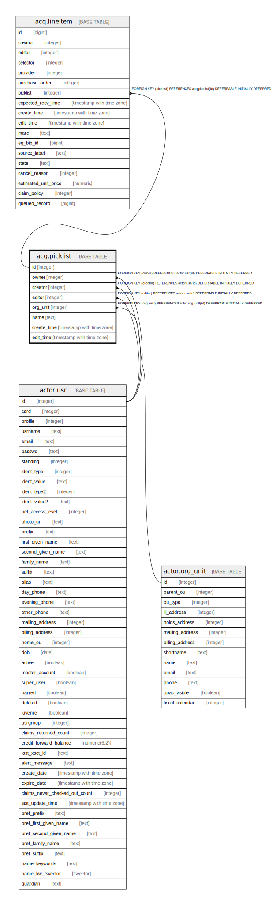

# acq.picklist

## Description

## Columns

| Name | Type | Default | Nullable | Children | Parents | Comment |
| ---- | ---- | ------- | -------- | -------- | ------- | ------- |
| id | integer | nextval('acq.picklist_id_seq'::regclass) | false | [acq.lineitem](acq.lineitem.md) |  |  |
| owner | integer |  | false |  | [actor.usr](actor.usr.md) |  |
| creator | integer |  | false |  | [actor.usr](actor.usr.md) |  |
| editor | integer |  | false |  | [actor.usr](actor.usr.md) |  |
| org_unit | integer |  | false |  | [actor.org_unit](actor.org_unit.md) |  |
| name | text |  | false |  |  |  |
| create_time | timestamp with time zone | now() | false |  |  |  |
| edit_time | timestamp with time zone | now() | false |  |  |  |

## Constraints

| Name | Type | Definition |
| ---- | ---- | ---------- |
| name_once_per_owner | UNIQUE | UNIQUE (name, owner) |
| picklist_pkey | PRIMARY KEY | PRIMARY KEY (id) |
| picklist_org_unit_fkey | FOREIGN KEY | FOREIGN KEY (org_unit) REFERENCES actor.org_unit(id) DEFERRABLE INITIALLY DEFERRED |
| picklist_creator_fkey | FOREIGN KEY | FOREIGN KEY (creator) REFERENCES actor.usr(id) DEFERRABLE INITIALLY DEFERRED |
| picklist_editor_fkey | FOREIGN KEY | FOREIGN KEY (editor) REFERENCES actor.usr(id) DEFERRABLE INITIALLY DEFERRED |
| picklist_owner_fkey | FOREIGN KEY | FOREIGN KEY (owner) REFERENCES actor.usr(id) DEFERRABLE INITIALLY DEFERRED |

## Indexes

| Name | Definition |
| ---- | ---------- |
| name_once_per_owner | CREATE UNIQUE INDEX name_once_per_owner ON acq.picklist USING btree (name, owner) |
| picklist_pkey | CREATE UNIQUE INDEX picklist_pkey ON acq.picklist USING btree (id) |
| acq_picklist_creator_idx | CREATE INDEX acq_picklist_creator_idx ON acq.picklist USING btree (creator) |
| acq_picklist_editor_idx | CREATE INDEX acq_picklist_editor_idx ON acq.picklist USING btree (editor) |
| acq_picklist_owner_idx | CREATE INDEX acq_picklist_owner_idx ON acq.picklist USING btree (owner) |

## Relations

---

> Generated by [tbls](https://github.com/k1LoW/tbls)
