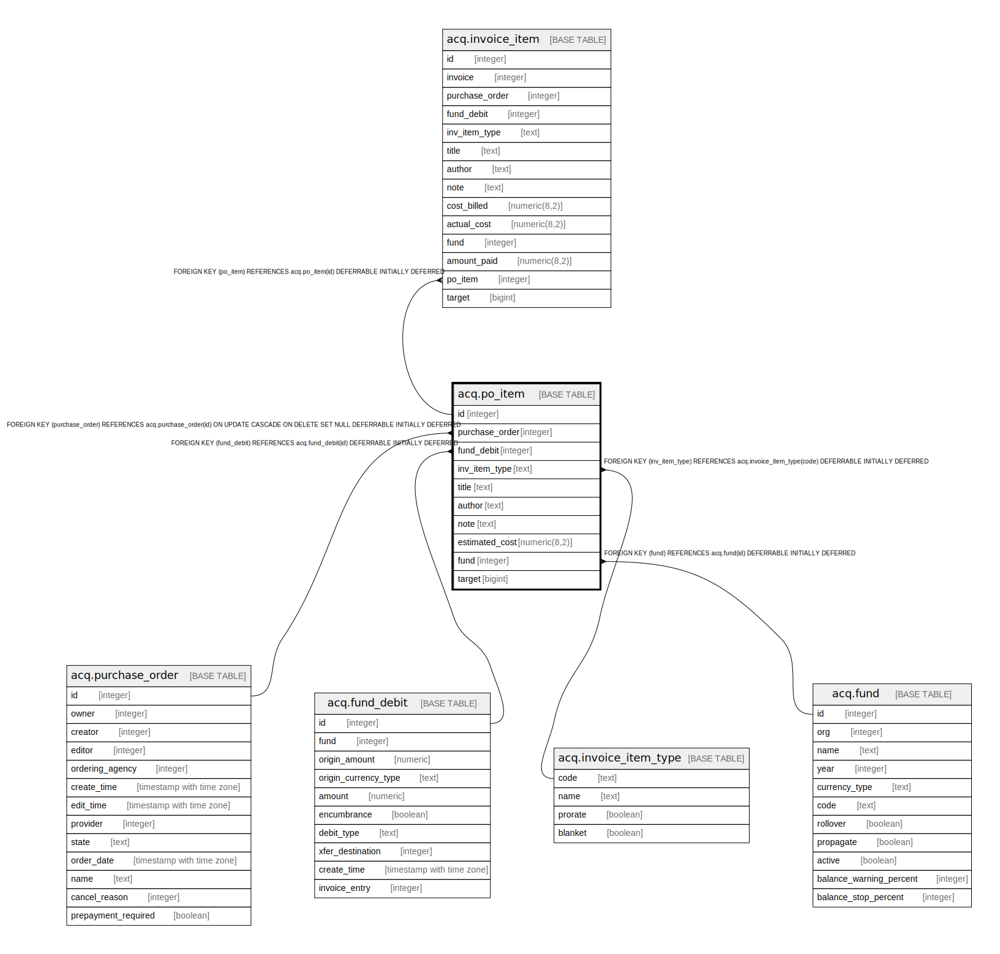

# acq.po_item

## Description

## Columns

| Name | Type | Default | Nullable | Children | Parents | Comment |
| ---- | ---- | ------- | -------- | -------- | ------- | ------- |
| id | integer | nextval('acq.po_item_id_seq'::regclass) | false | [acq.invoice_item](acq.invoice_item.md) |  |  |
| purchase_order | integer |  | true |  | [acq.purchase_order](acq.purchase_order.md) |  |
| fund_debit | integer |  | true |  | [acq.fund_debit](acq.fund_debit.md) |  |
| inv_item_type | text |  | false |  | [acq.invoice_item_type](acq.invoice_item_type.md) |  |
| title | text |  | true |  |  |  |
| author | text |  | true |  |  |  |
| note | text |  | true |  |  |  |
| estimated_cost | numeric(8,2) |  | true |  |  |  |
| fund | integer |  | true |  | [acq.fund](acq.fund.md) |  |
| target | bigint |  | true |  |  |  |

## Constraints

| Name | Type | Definition |
| ---- | ---- | ---------- |
| po_item_fund_debit_fkey | FOREIGN KEY | FOREIGN KEY (fund_debit) REFERENCES acq.fund_debit(id) DEFERRABLE INITIALLY DEFERRED |
| po_item_fund_fkey | FOREIGN KEY | FOREIGN KEY (fund) REFERENCES acq.fund(id) DEFERRABLE INITIALLY DEFERRED |
| po_item_inv_item_type_fkey | FOREIGN KEY | FOREIGN KEY (inv_item_type) REFERENCES acq.invoice_item_type(code) DEFERRABLE INITIALLY DEFERRED |
| po_item_pkey | PRIMARY KEY | PRIMARY KEY (id) |
| po_item_purchase_order_fkey | FOREIGN KEY | FOREIGN KEY (purchase_order) REFERENCES acq.purchase_order(id) ON UPDATE CASCADE ON DELETE SET NULL DEFERRABLE INITIALLY DEFERRED |

## Indexes

| Name | Definition |
| ---- | ---------- |
| po_item_pkey | CREATE UNIQUE INDEX po_item_pkey ON acq.po_item USING btree (id) |
| poi_po_idx | CREATE INDEX poi_po_idx ON acq.po_item USING btree (purchase_order) |

## Relations

---

> Generated by [tbls](https://github.com/k1LoW/tbls)
