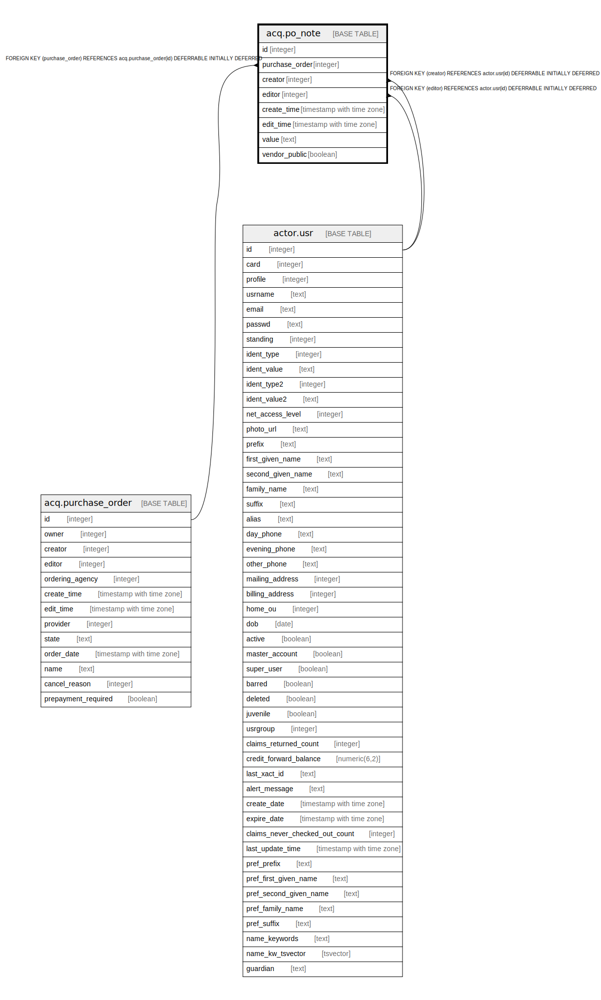

# acq.po_note

## Description

## Columns

| Name | Type | Default | Nullable | Children | Parents | Comment |
| ---- | ---- | ------- | -------- | -------- | ------- | ------- |
| id | integer | nextval('acq.po_note_id_seq'::regclass) | false |  |  |  |
| purchase_order | integer |  | false |  | [acq.purchase_order](acq.purchase_order.md) |  |
| creator | integer |  | false |  | [actor.usr](actor.usr.md) |  |
| editor | integer |  | false |  | [actor.usr](actor.usr.md) |  |
| create_time | timestamp with time zone | now() | false |  |  |  |
| edit_time | timestamp with time zone | now() | false |  |  |  |
| value | text |  | false |  |  |  |
| vendor_public | boolean | false | false |  |  |  |

## Constraints

| Name | Type | Definition |
| ---- | ---- | ---------- |
| po_note_pkey | PRIMARY KEY | PRIMARY KEY (id) |
| po_note_purchase_order_fkey | FOREIGN KEY | FOREIGN KEY (purchase_order) REFERENCES acq.purchase_order(id) DEFERRABLE INITIALLY DEFERRED |
| po_note_creator_fkey | FOREIGN KEY | FOREIGN KEY (creator) REFERENCES actor.usr(id) DEFERRABLE INITIALLY DEFERRED |
| po_note_editor_fkey | FOREIGN KEY | FOREIGN KEY (editor) REFERENCES actor.usr(id) DEFERRABLE INITIALLY DEFERRED |

## Indexes

| Name | Definition |
| ---- | ---------- |
| po_note_pkey | CREATE UNIQUE INDEX po_note_pkey ON acq.po_note USING btree (id) |
| acq_po_note_creator_idx | CREATE INDEX acq_po_note_creator_idx ON acq.po_note USING btree (creator) |
| acq_po_note_editor_idx | CREATE INDEX acq_po_note_editor_idx ON acq.po_note USING btree (editor) |
| po_note_po_idx | CREATE INDEX po_note_po_idx ON acq.po_note USING btree (purchase_order) |

## Relations

---

> Generated by [tbls](https://github.com/k1LoW/tbls)
