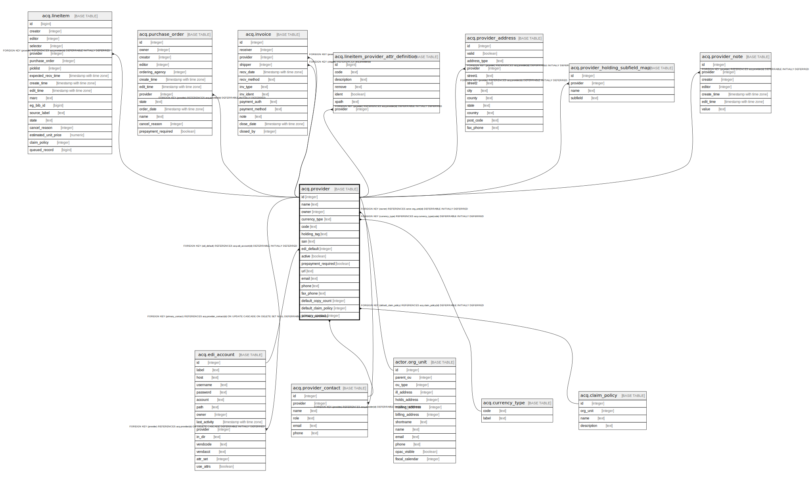

# acq.provider

## Description

## Columns

| Name | Type | Default | Nullable | Children | Parents | Comment |
| ---- | ---- | ------- | -------- | -------- | ------- | ------- |
| id | integer | nextval('acq.provider_id_seq'::regclass) | false | [acq.lineitem](acq.lineitem.md) [acq.purchase_order](acq.purchase_order.md) [acq.edi_account](acq.edi_account.md) [acq.invoice](acq.invoice.md) [acq.lineitem_provider_attr_definition](acq.lineitem_provider_attr_definition.md) [acq.provider_address](acq.provider_address.md) [acq.provider_contact](acq.provider_contact.md) [acq.provider_holding_subfield_map](acq.provider_holding_subfield_map.md) [acq.provider_note](acq.provider_note.md) |  |  |
| name | text |  | false |  |  |  |
| owner | integer |  | false |  | [actor.org_unit](actor.org_unit.md) |  |
| currency_type | text |  | false |  | [acq.currency_type](acq.currency_type.md) |  |
| code | text |  | false |  |  |  |
| holding_tag | text |  | true |  |  |  |
| san | text |  | true |  |  |  |
| edi_default | integer |  | true |  | [acq.edi_account](acq.edi_account.md) |  |
| active | boolean | true | false |  |  |  |
| prepayment_required | boolean | false | false |  |  |  |
| url | text |  | true |  |  |  |
| email | text |  | true |  |  |  |
| phone | text |  | true |  |  |  |
| fax_phone | text |  | true |  |  |  |
| default_copy_count | integer | 0 | false |  |  |  |
| default_claim_policy | integer |  | true |  | [acq.claim_policy](acq.claim_policy.md) |  |
| primary_contact | integer |  | true |  | [acq.provider_contact](acq.provider_contact.md) |  |

## Constraints

| Name | Type | Definition |
| ---- | ---- | ---------- |
| provider_default_claim_policy_fkey | FOREIGN KEY | FOREIGN KEY (default_claim_policy) REFERENCES acq.claim_policy(id) DEFERRABLE INITIALLY DEFERRED |
| code_once_per_owner | UNIQUE | UNIQUE (code, owner) |
| provider_currency_type_fkey | FOREIGN KEY | FOREIGN KEY (currency_type) REFERENCES acq.currency_type(code) DEFERRABLE INITIALLY DEFERRED |
| acq_provider_edi_default_fkey | FOREIGN KEY | FOREIGN KEY (edi_default) REFERENCES acq.edi_account(id) DEFERRABLE INITIALLY DEFERRED |
| acq_provider_primary_contact_fkey | FOREIGN KEY | FOREIGN KEY (primary_contact) REFERENCES acq.provider_contact(id) ON UPDATE CASCADE ON DELETE SET NULL DEFERRABLE INITIALLY DEFERRED |
| provider_name_once_per_owner | UNIQUE | UNIQUE (name, owner) |
| provider_pkey | PRIMARY KEY | PRIMARY KEY (id) |
| provider_owner_fkey | FOREIGN KEY | FOREIGN KEY (owner) REFERENCES actor.org_unit(id) DEFERRABLE INITIALLY DEFERRED |

## Indexes

| Name | Definition |
| ---- | ---------- |
| code_once_per_owner | CREATE UNIQUE INDEX code_once_per_owner ON acq.provider USING btree (code, owner) |
| provider_name_once_per_owner | CREATE UNIQUE INDEX provider_name_once_per_owner ON acq.provider USING btree (name, owner) |
| provider_pkey | CREATE UNIQUE INDEX provider_pkey ON acq.provider USING btree (id) |

## Relations

---

> Generated by [tbls](https://github.com/k1LoW/tbls)
