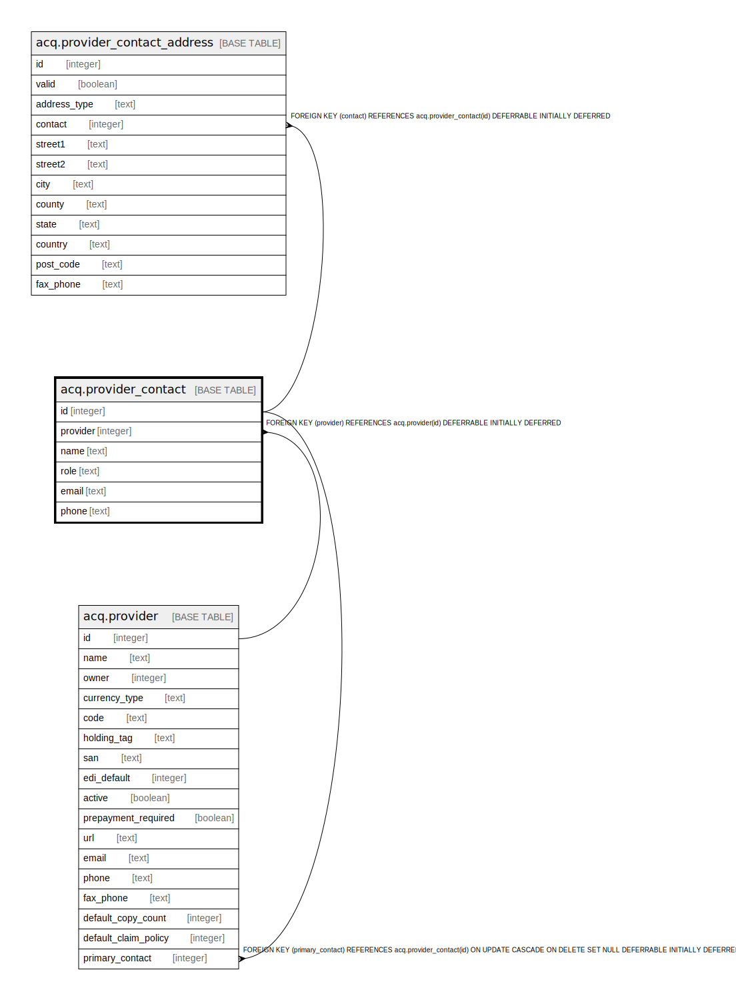

# acq.provider_contact

## Description

## Columns

| Name | Type | Default | Nullable | Children | Parents | Comment |
| ---- | ---- | ------- | -------- | -------- | ------- | ------- |
| id | integer | nextval('acq.provider_contact_id_seq'::regclass) | false | [acq.provider](acq.provider.md) [acq.provider_contact_address](acq.provider_contact_address.md) |  |  |
| provider | integer |  | false |  | [acq.provider](acq.provider.md) |  |
| name | text |  | false |  |  |  |
| role | text |  | true |  |  |  |
| email | text |  | true |  |  |  |
| phone | text |  | true |  |  |  |

## Constraints

| Name | Type | Definition |
| ---- | ---- | ---------- |
| provider_contact_pkey | PRIMARY KEY | PRIMARY KEY (id) |
| provider_contact_provider_fkey | FOREIGN KEY | FOREIGN KEY (provider) REFERENCES acq.provider(id) DEFERRABLE INITIALLY DEFERRED |

## Indexes

| Name | Definition |
| ---- | ---------- |
| provider_contact_pkey | CREATE UNIQUE INDEX provider_contact_pkey ON acq.provider_contact USING btree (id) |

## Relations

---

> Generated by [tbls](https://github.com/k1LoW/tbls)
